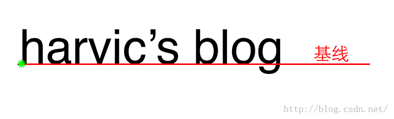

## 绘制文本
### 绘制文本需要的基线:

* baseline: 基线,文字绘制开始的基线
* ascent: 系统建议的,绘制单个字符时,字符应当的最高高度所在线;
* descent:系统建议的，绘制单个字符时，字符应当的最低高度所在线
* top: 可绘制的最高高度所在线
* bottom: 可绘制的最低高度所在线

### 绘制文字的方法:
* `public void drawText(String text,float x,float y,Paint paint)`
* 参数说明:
	* text: 绘制的文字
	* x: 绘制文字的原点x坐标
	* y: 绘制文字的原点y坐标-----同时也是基线的y坐标
	* paint: 绘制文字的画笔
* 其中(x,y)该点的文字,应该为如下图中绿点位置:

###  drawText(text, x, y, paint)x代表什么呢？

* y代表基线的y坐标,而x代表所要绘制文字所在矩形的相对位置,相对位置就是指指定点（x,y）在所要绘制矩形的位置.绘制矩形的纵坐标是由Y值来确定的，而相对x坐标的位置，只有左、中、右三个位置了。也就是所绘制矩形可能是在x坐标的左侧绘制，也有可能在x坐标的中间，也有可能在x坐标的右侧。
* 定义x坐标在所绘制矩形相对位置的函数是：
		
		/** 
	    * 其中Align的取值为：Panit.Align.LEFT,Paint.Align.CENTER,Paint.Align.RIGHT 
	    */  
	    Paint::setTextAlign(Align align);  

* 通过设置textAlign(),来设置绘制文字的起始绘制文字:
	* Left: 文字从文字所在矩形最左侧绘制,
	* Center: 文字从文字所在矩形中心绘制
	* Right: 文字从文字所在矩形的最右侧绘制

### 关于FontMetrics类:
* FontMetric类提供了baseline,ascent等的计算方式:

	* ascent = ascent线的y坐标 - baseline线的y坐标；(负值)
    * descent = descent线的y坐标 - baseline线的y坐标；
    * top = top线的y坐标 - baseline线的y坐标；(负值)
    * bottom = bottom线的y坐标 - baseline线的y坐标；

* 计算四各线的位置:
	
		//计算各线在位置  
	    Paint.FontMetrics fm = paint.getFontMetrics();  
	    float ascent = baseLineY + fm.ascent;  
	    float descent = baseLineY + fm.descent;  
	    float top = baseLineY + fm.top;  
	    float bottom = baseLineY + fm.bottom;  
   
### 绘制文字的高度,宽度,以及最小矩形:

* 文字高度:

	    Paint.FontMetricsInt fm = paint.getFontMetricsInt();  
	    int top = baseLineY + fm.top;  
	    int bottom = baseLineY + fm.bottom;  
	    //所占高度  
	    int height = bottom - top;  

* 高度:
	
		Paint paint = new Paint();  
	    //设置paint  
	    paint.setTextSize(120); //以px为单位  
	    //获取宽度  
	    int width = (int)paint.measureText("harvic\'s blog");  

* 最小矩形:
	
		/* 获取指定字符串所对应的最小矩形，以（0，0）点所在位置为基线 
		 * @param text  要测量最小矩形的字符串 
		 * @param start 要测量起始字符在字符串中的索引 
		 * @param end   所要测量的字符的长度 
		 * @param bounds 接收测量结果 
		 * /
		 public void getTextBounds(String text, int start, int end, Rect bounds);`
 

		
