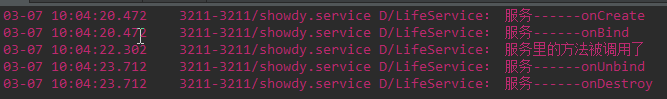
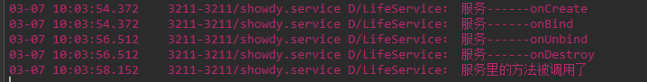

## Service 服务
### 什么是服务:
> `A service is not a separate process and A service is not thread; A Service is an application component that can perform long-running opreations in the background and doesnot provider a userinterface.`

* 服务是一个无界面化的应用程序组件
* 服务一般用于后台进行耗时操作

### Service的生命周期:

#### startService方式开启服务:
* `startService(Intent service)`，通过intent值来指定启动哪个Service，可以直接指定目标Service的名，也可以通过Intent的action属性来启动设置了相应action属性的Service，使用这种方式启动的Service，当启动它的Activity被销毁时，是不会影响到它的运行的，这时它仍然继续在后台运行它的工作。直至调用`StopService（Intent service）`方法时或者是当系统资源非常紧缺时，这个服务才会调用onDestory()方法停止运行。所以这种Service一般可以用做，处理一些耗时的工作。
* 四大组件默认都是和activity运行在同一个主线程中的，那就是说activity通过startservice方法启动一个服务后，被启动的服务和activity都是在同一个线程中的。所以当我主动销毁了这个activity，但是他所在的线程还是存在的，只不过是这个activity他所占用的资源被释放掉了，这个activity所在的主线程只有当android内存不足才会被杀死掉，否则一般的情况下这个activity所在的应用程序的线程始终存在，也就是这个activity所启动的服务也会一直运行下去。
#####Service
```java

	public class LifeService extends Service {
	    private static final String TAG = "LifeService";

	    @Override
	    public void onCreate() {
	        Log.d(TAG, "服务------onCreate");
	        super.onCreate();
	
	    }
	    @Override
	    public int onStartCommand(Intent intent, int flags, int startId) {
	        Log.d(TAG, "服务------onStartCommand");
	        return super.onStartCommand(intent, flags, startId);
	    }
	    @Override
	    public void onDestroy() {
	        Log.d(TAG, "服务------onDestroy");
	        super.onDestroy();
	    }
	}
```

##### Activity	
```java

	public class MainActivity extends AppCompatActivity {
	
	    @Override
	    protected void onCreate(Bundle savedInstanceState) {
	        super.onCreate(savedInstanceState);
	        setContentView(R.layout.activity_main);
	    }
	
	    public void startService(View view) {
	        Intent intent = new Intent(this, LifeService.class);
	        startService(intent);
	    }
	
	    public void stopService(View view) {
	
	        Intent intent = new Intent(this, LifeService.class);
	        stopService(intent);
	    }
	}
```

##### 运行结果:

> Service 可以被开启多次,但是只会创建一次.

#### bindService方式开启服务
* bindService开启的服务,可以调用到服务中的方法.
* 启动的LifeService是和MainActivity在同一个进程里的，因为在注册服务时，没有配置它的android:process = "xxxx" 属性。
##### Service
```java

	public class LifeService extends Service {
	    private static final String TAG = "LifeService";

	    @Override
	    public void onCreate() {
	        Log.d(TAG, "服务------onCreate");
	        super.onCreate();
	    }
	
	    @Override
	    public int onStartCommand(Intent intent, int flags, int startId) {
	        Log.d(TAG, "服务------onStartCommand");
	        return super.onStartCommand(intent, flags, startId);
	    }
	
	    @Override
	    public void onDestroy() {
	        Log.d(TAG, "服务------onDestroy");
	        super.onDestroy();
	    }
	
	    @Override
	    public boolean onUnbind(Intent intent) {
	        Log.d(TAG, "服务------onUnbind");
	        return super.onUnbind(intent);
	    }
	
	    @Nullable
	    @Override
	    public IBinder onBind(Intent intent) {
	        Log.d(TAG, "服务------onBind");
	        return new Mybind();
	    }
	
	    public class Mybind extends Binder {
	
	        public void callMethodInService() {
	            methodInService();
	        }
	
	    }
	    
	    public void methodInService() {
	        Toast.makeText(this, "服务里的方法被调用了", Toast.LENGTH_SHORT).show();
	        Log.d(TAG, "服务里的方法被调用了");
	    }	
	}
```

##### Activity
```java

	public class MainActivity extends AppCompatActivity {
	
	    private ServiceConnection conn;
	    private LifeService.Mybind mBinder;
	
	    @Override
	    protected void onCreate(Bundle savedInstanceState) {
	        super.onCreate(savedInstanceState);
	        setContentView(R.layout.activity_main);
	    }
		
		//绑定服务
	    public void bindService(View view) {
	        Intent intent = new Intent(this, LifeService.class);
	        conn = new MyServiceConnection();
	        bindService(intent, conn, BIND_AUTO_CREATE);
	    }
	
	    private class MyServiceConnection implements ServiceConnection {
	
	        @Override
	        public void onServiceConnected(ComponentName name, IBinder service) {
	            mBinder = (LifeService.Mybind) service;
	
	        }
	
	        @Override
	        public void onServiceDisconnected(ComponentName name) {
	
	        }
	    }
	
		//解绑服务
	    public void unbindService(View view) {
	        unbindService(conn);
	    }
		//调用服务里的方法
	    public void callMethodInService(View view) {
	        mBinder.callMethodInService();
	    }
	}
```

##### 运行结果


出现一个有意思的现象: 当解绑服务后,service已经onDestroy(),但是还是能调用服务中的方法.运行图如下:

> 服务虽然是onDestroy了,但是MainActivity中还保留LifeService.Binder的引用,服务中的方法也保留了Service自身的引用,所以即便是Service onDestroy()了,但是还是可以调用到服务中的方法.

####混合方式开启服务
* startService开启服务: 服务能在后台长期运行,不能调用服务中方法.
* bindService开启服务: 能调用服务中的方法,但是不能在后台长期运行.
* 混合方式开启服务: 保证服务后台长期运行, 还能调用服务中的方法.

##### Service
```java

	public class LifeService extends Service {
	    private static final String TAG = "LifeService";
	
	
	    @Override
	    public void onCreate() {
	        Log.d(TAG, "服务------onCreate");
	        super.onCreate();
	
	    }
	
	    @Override
	    public int onStartCommand(Intent intent, int flags, int startId) {
	        Log.d(TAG, "服务------onStartCommand");
	        return super.onStartCommand(intent, flags, startId);
	    }
	
	    @Override
	    public void onDestroy() {
	        Log.d(TAG, "服务------onDestroy");
	        super.onDestroy();
	    }
	
	    @Override
	    public boolean onUnbind(Intent intent) {
	        Log.d(TAG, "服务------onUnbind");
	        return super.onUnbind(intent);
	    }
	
	    @Nullable
	    @Override
	    public IBinder onBind(Intent intent) {
	        Log.d(TAG, "服务------onBind");
	        return new Mybind();
	    }
	
	    public class Mybind extends Binder {
	
	        public void callMethodInService() {
	            methodInService();
	        }
	
	    }
	
	
	    public void methodInService() {
	        Toast.makeText(this, "服务里的方法被调用了", Toast.LENGTH_SHORT).show();
	        Log.d(TAG, "服务里的方法被调用了");
	    }
	
	}
```

##### Activity
```java

	public class MainActivity extends AppCompatActivity {
	    private ServiceConnection conn;
	    private LifeService.Mybind mBinder;
	
	    @Override
	    protected void onCreate(Bundle savedInstanceState) {
	        super.onCreate(savedInstanceState);
	        setContentView(R.layout.activity_main);
	    }
		//开启服务
	    public void startService(View view) {
	        Intent intent = new Intent(this, LifeService.class);
	        startService(intent);
	    }
		//停止服务
	    public void stopService(View view) {
	        Intent intent = new Intent(this, LifeService.class);
	        stopService(intent);
	    }
	
		//绑定服务
	    public void bindService(View view) {
	        Intent intent = new Intent(this, LifeService.class);
	        conn = new MyServiceConnection();
	        bindService(intent, conn, BIND_AUTO_CREATE);
	    }
		//解绑服务
	    public void unbindService(View view) {
	        unbindService(conn);
	    }
	
	    private class MyServiceConnection implements ServiceConnection {
	
	        @Override
	        public void onServiceConnected(ComponentName name, IBinder service) {
	            mBinder = (LifeService.Mybind) service;
	        }
	
	        @Override
	        public void onServiceDisconnected(ComponentName name) {
	
	        }
	    }
		//调用服务中的方法
	    public void callMethodInService(View view) {
	        mBinder.callMethodInService();
	    }
	}
```

##### 运行结果


注意几点: 

*  以startService方式开启的服务, 解绑服务,并不能使服务onDestroy
*  `IBinder: the communication channel to the service,may return null if clients not connect to services.`
*  `unlike other application components, calls on to the IBinder interface returned here may not happen on the main thread of the process`
 	
#### 接口
> 利用接口屏蔽方法内部实现的细节, 只暴露需要暴露的方法.
##### IService
```java

	public interface IService {
	    void callMethodInService();
	}
```

##### Service
```java

	private class Mybind extends Binder implements IService {
	    public void callMethodInService() {
	            methodInService();
	    }
	
	}
```

##### Activity
```java	

	private class MyServiceConnection implements ServiceConnection {
	
	     @Override
	     public void onServiceConnected(ComponentName name, IBinder service) {
			//转化Iservice对象
	         mIService = (IService) service;
	     }
	      @Override
	      public void onServiceDisconnected(ComponentName name) {
	
	      }
	 }
```
    
###  IntentService 类
Service 的子类，它使用工作线程逐一处理所有启动请求。如果您不要求服务同时处理多个请求，这是最好的选择。 您只需实现 onHandleIntent() 方法即可，该方法会接收每个启动请求的 Intent，使您能够执行后台工作。由于大多数启动服务都不必同时处理多个请求（实际上，这种多线程情况可能很危险），因此使用 IntentService 类实现服务也许是最好的选择。

IntentService 执行以下操作：

* 创建默认的工作线程，用于在应用的主线程外执行传递给 onStartCommand() 的所有 Intent。
* 创建工作队列，用于将 Intent 逐一传递给 onHandleIntent() 实现，这样您就永远不必担心多线程问题。
* 在处理完所有启动请求后停止服务，因此您永远不必调用 stopSelf()。
* 提供 onBind() 的默认实现（返回 null）。
* 提供 onStartCommand() 的默认实现，可将 Intent 依次发送到工作队列和 onHandleIntent() 实现。

综上所述，您只需实现 onHandleIntent() 来完成客户端提供的工作即可。（不过，您还需要为服务提供小型构造函数。）

```java

	public class HelloIntentService extends IntentService {
	
	  /**
	   * A constructor is required, and must call the super IntentService(String)
	   * constructor with a name for the worker thread.
	   */
	  public HelloIntentService() {
	      super("HelloIntentService");
	  }
	
	  /**
	   * The IntentService calls this method from the default worker thread with
	   * the intent that started the service. When this method returns, IntentService
	   * stops the service, as appropriate.
	   */
	  @Override
	  protected void onHandleIntent(Intent intent) {
	      // Normally we would do some work here, like download a file.
	      // For our sample, we just sleep for 5 seconds.
	      try {
	          Thread.sleep(5000);
	      } catch (InterruptedException e) {
	          // Restore interrupt status.
	          Thread.currentThread().interrupt();
	      }
	  }
	}
```
您只需要一个构造函数和一个 onHandleIntent() 实现即可。如果您决定还重写其他回调方法（如 onCreate()、onStartCommand() 或 onDestroy()），请确保调用超类实现，以便 IntentService 能够妥善处理工作线程的生命周期。

### 执行多线程耗时操作Service

正如上一部分中所述，使用 IntentService 显著简化了启动服务的实现。但是，若要求服务执行多线程（而不是通过工作队列处理启动请求），则可扩展 Service 类来处理每个 Intent。

为了便于比较，以下提供了 Service 类实现的代码示例，该类执行的工作与上述使用 IntentService 的示例完全相同。也就是说，对于每个启动请求，它均使用工作线程执行作业，且每次仅处理一个请求。

```java

	public class HelloService extends Service {
	  private Looper mServiceLooper;
	  private ServiceHandler mServiceHandler;
	
	  // Handler that receives messages from the thread
	  private final class ServiceHandler extends Handler {
	      public ServiceHandler(Looper looper) {
	          super(looper);
	      }
	      @Override
	      public void handleMessage(Message msg) {
	          // Normally we would do some work here, like download a file.
	          // For our sample, we just sleep for 5 seconds.
	          try {
	              Thread.sleep(5000);
	          } catch (InterruptedException e) {
	              // Restore interrupt status.
	              Thread.currentThread().interrupt();
	          }
	          // Stop the service using the startId, so that we don't stop
	          // the service in the middle of handling another job
	          stopSelf(msg.arg1);
	      }
	  }
	
	  @Override
	  public void onCreate() {
	    // Start up the thread running the service.  Note that we create a
	    // separate thread because the service normally runs in the process's
	    // main thread, which we don't want to block.  We also make it
	    // background priority so CPU-intensive work will not disrupt our UI.
	    HandlerThread thread = new HandlerThread("ServiceStartArguments",
	            Process.THREAD_PRIORITY_BACKGROUND);
	    thread.start();
	
	    // Get the HandlerThread's Looper and use it for our Handler
	    mServiceLooper = thread.getLooper();
	    mServiceHandler = new ServiceHandler(mServiceLooper);
	  }
	
	  @Override
	  public int onStartCommand(Intent intent, int flags, int startId) {
	      Toast.makeText(this, "service starting", Toast.LENGTH_SHORT).show();
	
	      // For each start request, send a message to start a job and deliver the
	      // start ID so we know which request we're stopping when we finish the job
	      Message msg = mServiceHandler.obtainMessage();
	      msg.arg1 = startId;
	      mServiceHandler.sendMessage(msg);
	
	      // If we get killed, after returning from here, restart
	      return START_STICKY;
	  }
	
	  @Override
	  public IBinder onBind(Intent intent) {
	      // We don't provide binding, so return null
	      return null;
	  }
	
	  @Override
	  public void onDestroy() {
	    Toast.makeText(this, "service done", Toast.LENGTH_SHORT).show();
	  }
	}
```

正如您所见，与使用 IntentService 相比，这需要执行更多工作。

但是，因为是由您自己处理对 onStartCommand() 的每个调用，因此可以同时执行多个请求。此示例并未这样做，但如果您希望如此，则可为每个请求创建一个新线程，然后立即运行这些线程（而不是等待上一个请求完成）。

请注意，onStartCommand() 方法必须返回整型数。整型数是一个值，用于描述系统应该如何在服务终止的情况下继续运行服务（如上所述，IntentService 的默认实现将为您处理这种情况，不过您可以对其进行修改）。从 onStartCommand() 返回的值必须是以下常量之一：

* **`START_NOT_STICKY`**

	如果系统在 onStartCommand() 返回后终止服务，则除非有挂起 Intent 要传递，否则系统不会重建服务。这是最安全的选项，可以避免在不必要时以及应用能够轻松重启所有未完成的作业时运行服务。
* **`START_STICKY`**

	如果系统在 onStartCommand() 返回后终止服务，则会重建服务并调用 onStartCommand()，但不会重新传递最后一个 Intent。相反，除非有挂起 Intent 要启动服务（在这种情况下，将传递这些 Intent ），否则系统会通过空 Intent 调用 onStartCommand()。这适用于不执行命令、但无限期运行并等待作业的媒体播放器（或类似服务）。
* **`START_REDELIVER_INTENT`**

	如果系统在 onStartCommand() 返回后终止服务，则会重建服务，并通过传递给服务的最后一个 Intent 调用 onStartCommand()。任何挂起 Intent 均依次传递。这适用于主动执行应该立即恢复的作业（例如下载文件）的服务。

### 前台服务

```java

	public class ForegroundService extends Service {

	    @Override
	    public void onCreate() {
	        super.onCreate();
	
	        showNotification();
	    }
	
	    private void showNotification() {
	        
	        //创建点击跳转Intent
	        Intent inten = new Intent(this, MainActivity.class);
	        //创建任务栈Builder
	        TaskStackBuilder taskStackBuilder = TaskStackBuilder.create(this);
	        taskStackBuilder.addParentStack(MainActivity.class);
	        taskStackBuilder.addNextIntent(inten);
	        PendingIntent pendingIntent = taskStackBuilder.getPendingIntent(0, PendingIntent.FLAG_UPDATE_CURRENT);
	
	        //创建通知详细信息
	        Notification notification = new NotificationCompat.Builder(this)
	                .setSmallIcon(R.mipmap.ic_launcher)
	                .setContentTitle("foreground service")
	                .setContentText("show details news")
	                .setWhen(System.currentTimeMillis())
	                .setContentIntent(pendingIntent)
	                .build();
	        
	        NotificationManager nm = (NotificationManager) getSystemService(Context.NOTIFICATION_SERVICE);
	        nm.notify(0, notification);
	        startForeground(0,notification);
	
	    }
	}

```

### 系统服务


系统服务提供了很多便捷服务，可以查询Wifi、网络状态、查询电量、查询音量、查询包名、查询Application信息等等等相关多的服务，具体大家可以自信查询文档，这里举例几个常见的服务

1. 判断Wifi是否开启

	```java
	
		WifiManager wm = (WifiManager) getSystemService(WIFI_SERVICE);
		boolean enabled = wm.isWifiEnabled();
	```

2. 获取系统最大音量


	```java
	
		AudioManager am = (AudioManager) getSystemService(AUDIO_SERVICE);
		int max = am.getStreamMaxVolume(AudioManager.STREAM_SYSTEM);
	```
3. 获取当前音量
	
	```java
	
		AudioManager am = (AudioManager) getSystemService(AUDIO_SERVICE);
		int current = am.getStreamMaxVolume(AudioManager.STREAM_RING);
	```
4. 判断网络是否有连接

	```java
	
		ConnectivityManager cm = (ConnectivityManager) getSystemService(CONNECTIVITY_SERVICE);
		NetworkInfo info = cm.getActiveNetworkInfo();
		boolean isAvailable = info.isAvailable();
	```

### AIDL跨进程服务

### AccessibilityService无障碍服务
