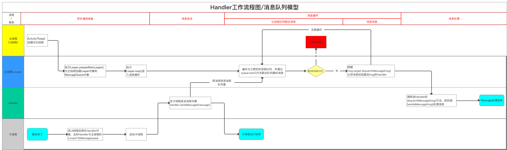
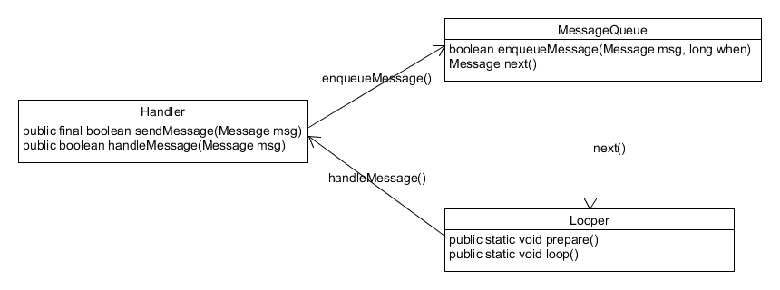
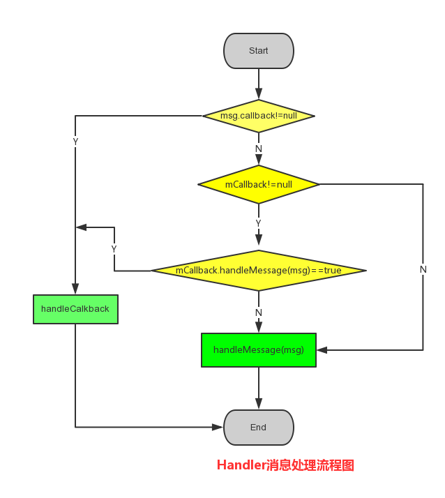

## Android消息机制
> android消息机制的核心类:

* Looper
* Handler
* MessageQueue---单链表
* Message
* ThreadLocal<T>

### Handler异步通信机制工作流程图

### Handler.Looper.MessageQueue关系图:

### Handler核心类:
* Handler:
	* `Looper`(当前线程`ThraedLocal<Looper>`)
	* `MessageQueue`(即为`Looper`关联的`MessageQueue`)
	* `Imessenger`(实现进程之间的通讯)

*  **Handler工作流程图:**

	

* handler发送消息:
	* send方案发送消息(最终将消息放入消息队列中,即`queue.enqueue()`):
		
		private boolean enqueueMessage(MessageQueue queue, Message msg, long uptimeMillis) {
	        msg.target = this;
	        if (mAsynchronous) {
	            msg.setAsynchronous(true);
	        }
	        return queue.enqueueMessage(msg, uptimeMillis);
	    }
	* post方法发送消息:(将`runnable()`封装成Message后,放入队列中)
		
		 private static Message getPostMessage(Runnable r) {
	        Message m = Message.obtain();
	        m.callback = r;
	        return m;
	    }

* handler处理消息:
	

	    public void dispatchMessage(Message msg) {
	        if (msg.callback != null) {
	            handleCallback(msg);
	        } else {
	            if (mCallback != null) {
	                if (mCallback.handleMessage(msg)) {
	                    return;
	                }
	            }
	            handleMessage(msg);
	        }
	    }

### Looper核心类:
> 关联MessageQueue,每个Looper对象中都有一个MessageQueue用于存储消息, 关联一个ThreadLocal<Looper>用于存储当前线程的Looper对象.

* looper.prepare()

		private static void prepare(boolean quitAllowed) {
	        if (sThreadLocal.get() != null) {
	            throw new RuntimeException("Only one Looper may be created per thread");
	        }
			//将looper存储于ThreadLocal中
	        sThreadLocal.set(new Looper(quitAllowed));
	    }
		
* looper.loop():
	> 核心就不断从队列中取出消息,并处理消息, 如果队列中没有消息looper出现阻塞.

		public static void loop() {
	        //.....
	        for (;;) {
	            Message msg = queue.next(); // might block
	            if (msg == null) {
	                // No message indicates that the message queue is quitting.
	                return;
	            }
				//.....
	            msg.target.dispatchMessage(msg);
				//.....
	            msg.recycleUnchecked();
	        }
	    }
* 将线程变为looper线程, 类似于HandlerThread:
	
		public class LooperThread extends Thread {
		    @Override
		    public void run() {
		        // 将当前线程初始化为Looper线程
		        Looper.prepare();
		
		        // ...其他处理，如实例化handler
		
		        // 开始循环处理消息队列
		        Looper.loop();
		    }
		}

### MessageQueue:
> MessageQueue内部并不是队列,而是通过单链表结构来维护消息列表,单链表在插入和删除上比较有优势.

* 插入功能(enqueueMessage())

* 取出功能(next())即链表的删除功能)

###主线程的消息循环:
* Android的主线程就是ActivityThread,入口方法main();通常在新打开一个APK界面时，ActivityManagerService会为该APK启动一个新的新建ActivityThread作为该APK的主线程。该主线程的main函数主要做了两件事：

	* 新建ActivityThread对象。 
	* 使用主线程进入消息循环。

			public final class ActivityThread {
			
			    ...
			
			    public static void main(String[] args) {
			
			        ...
			
			        Looper.prepareMainLooper();
			
			        ActivityThread thread = new ActivityThread();
			        thread.attach(false);
			
			        ...
			
			        Looper.loop();
			
			        ...
			    }
			}

* 主线程消息循环后，需要一个Handler和消息队列交互:

		public final class ActivityThread {
	
		    ...
		
		    final H mH = new H();
		
		    ...
		
		    private class H extends Handler {
		        ... 
		
		        public void handleMessage(Message msg) {
		            ...
		
		            switch (msg.what) {
		                case LAUNCH_ACTIVITY: {
		                    Trace.traceBegin(Trace.TRACE_TAG_ACTIVITY_MANAGER, "activityStart");
		                    ActivityClientRecord r = (ActivityClientRecord)msg.obj;
		
		                    r.packageInfo = getPackageInfoNoCheck(
		                            r.activityInfo.applicationInfo, r.compatInfo);
		                    handleLaunchActivity(r, null);
		                    Trace.traceEnd(Trace.TRACE_TAG_ACTIVITY_MANAGER);
		                } break;
		
		                ...
		            }
		        }
		    }
		}

* `ActivityThread`通过`ApplicationThread`和AMS进行进程间通讯,AMS以进程间通讯的方法完成ActivityThread的请求后回调ApplicationThread中的Binder方法,然后ApplicationThread会向H发送消息,H收到消息后会将ApplicationThread逻辑切换到ActivityThread中执行,即切换到主线程中执行.

		public final class ActivityThread {
		    ...
		
		    private class ApplicationThread extends ApplicationThreadNative {
		        ...
		
		        public final void scheduleLaunchActivity(Intent intent, IBinder token, int ident,
		                ActivityInfo info, Configuration curConfig, CompatibilityInfo compatInfo,
		                int procState, Bundle state, List<ResultInfo> pendingResults,
		                List<Intent> pendingNewIntents, boolean notResumed, boolean isForward,
		                String profileName, ParcelFileDescriptor profileFd, boolean autoStopProfiler) {
		
		            ...
		
		            sendMessage(H.LAUNCH_ACTIVITY, r);
		        }
		
		        ...
		    }
		
		    ...
		
		    private void sendMessage(int what, Object obj) {
		        sendMessage(what, obj, 0, 0, false);
		    }
		
		    private void sendMessage(int what, Object obj, int arg1, int arg2, boolean async) {
		
		        Message msg = Message.obtain();
		        msg.what = what;
		        msg.obj = obj;
		        msg.arg1 = arg1;
		        msg.arg2 = arg2;
		        if (async) {
		            msg.setAsynchronous(true);
		        }
		        mH.sendMessage(msg);
		    }
		
		    ...
		}

### Handler内存泄露:
>This Handler class should be static or leaks might occur 。

* 确保class内部的handler不含有外部类的隐式引用 。 同一个线程下的handler共享一个looper对象，消息中保留了对handler的引用，只要有消息在队列中，那么handler便无法被回收，如果handler不是static那么使用Handler的Service和Activity就也无法被回收。这就可能导致内存泄露。
* 官方推荐将handler设为static类，并在里面使用弱引用WeakReference

		public class F4 extends Fragment {
		    Button button1;
		    View view;
		    public F4() {
		    }
		    //静态内部类Handler对象
		    static class MyHandler extends Handler {
		        //使用弱引用引用外部类
		        WeakReference<F4> weakReference;
		
		        //通过构造获取实例
		        public MyHandler(WeakReference<F4> weakReference) {
		            this.weakReference = weakReference;
		        }
		        @Override
		        public void handleMessage(Message msg) {
		            //更新主UI组件
		            //使用弱引用对象的get方法获取外部类对象
		            F4 temp = weakReference.get();
		            temp.button1.setText("xxxx");
		        }
		    }
		    //Handler对象实例化
		    MyHandler handler = new MyHandler(new WeakReference<F4>(this));
		    //发消息
		    public void btn1(View view) {
		        Message message = handler.obtainMessage();
		        message.sendToTarget();
		    }
		
		    @Override
		    public View onCreateView(LayoutInflater inflater, ViewGroup container,
		                             Bundle savedInstanceState) {
		
		        if (view == null) {
		            view = inflater.inflate(R.layout.fragment_f4, container, false);
		            button1 = (Button) view.findViewById(R.id.button1);
		            button1.setOnClickListener(new View.OnClickListener() {
		                @Override
		                public void onClick(View v) {
		                    btn1(v);
		                }
		            });
		        }
		        return view;
		    }
		

}