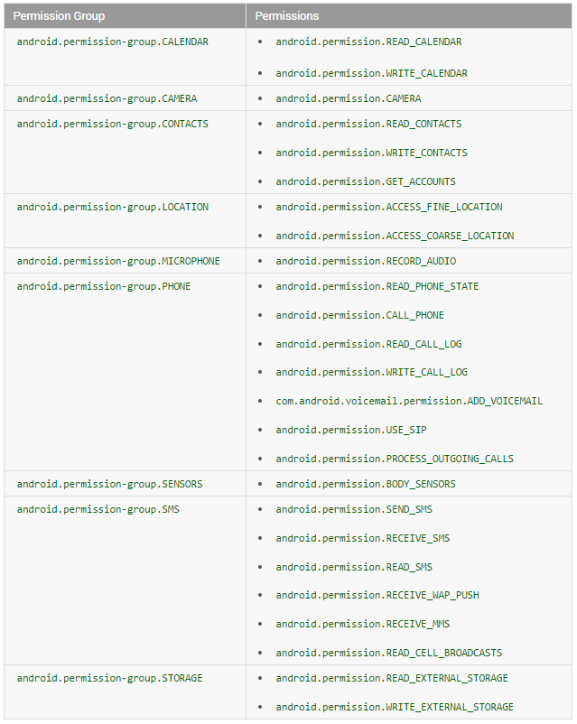

### Android M新的运行权限
* [android运行权限](http://developer.android.com/intl/zh-cn/about/versions/marshmallow/android-6.0-changes.html)

* [Working with System Permissions](http://developer.android.com/intl/zh-cn/training/permissions/index.html)

* [Permissions Best Practices](http://developer.android.com/intl/zh-cn/training/permissions/best-practices.html#testing)

* [PermissionsDispatcher](https://github.com/hotchemi/PermissionsDispatcher)

* [easypermissions](https://github.com/googlesamples/easypermissions)

### 权限机制
* google将权限分为两类, 一类是[Normal Permison](http://developer.android.com/intl/zh-cn/guide/topics/security/normal-permissions.html),这类权限一般不涉及用户隐私, 是不需要用户进行授权,比如手机的震动,访问网络等等,另一类是Dangerous Permission,一般是设计用户隐私的, 需要用户进行授权,比如访问sdcard,访问通讯录.
* Normal Permission
	
		android.permission.ACCESS_LOCATION_EXTRA_COMMANDS
		android.permission.ACCESS_NETWORK_STATE
		android.permission.ACCESS_NOTIFICATION_POLICY
		android.permission.ACCESS_WIFI_STATE
		android.permission.ACCESS_WIMAX_STATE
		android.permission.BLUETOOTH
		android.permission.BLUETOOTH_ADMIN
		android.permission.BROADCAST_STICKY
		android.permission.CHANGE_NETWORK_STATE
		android.permission.CHANGE_WIFI_MULTICAST_STATE
		android.permission.CHANGE_WIFI_STATE
		android.permission.CHANGE_WIMAX_STATE
		android.permission.DISABLE_KEYGUARD
		android.permission.EXPAND_STATUS_BAR
		android.permission.FLASHLIGHT
		android.permission.GET_ACCOUNTS
		android.permission.GET_PACKAGE_SIZE
		android.permission.INTERNET
		android.permission.KILL_BACKGROUND_PROCESSES
		android.permission.MODIFY_AUDIO_SETTINGS
		android.permission.NFC
		android.permission.READ_SYNC_SETTINGS
		android.permission.READ_SYNC_STATS
		android.permission.RECEIVE_BOOT_COMPLETED
		android.permission.REORDER_TASKS
		android.permission.REQUEST_INSTALL_PACKAGES
		android.permission.SET_TIME_ZONE
		android.permission.SET_WALLPAPER
		android.permission.SET_WALLPAPER_HINTS
		android.permission.SUBSCRIBED_FEEDS_READ
		android.permission.TRANSMIT_IR
		android.permission.USE_FINGERPRINT
		android.permission.VIBRATE
		android.permission.WAKE_LOCK
		android.permission.WRITE_SYNC_SETTINGS
		com.android.alarm.permission.SET_ALARM
		com.android.launcher.permission.INSTALL_SHORTCUT
		com.android.launcher.permission.UNINSTALL_SHORTCUT

* Dangerous Permission

	

	> **权限分组意义**: 如果app运行在Android 6.x的机器上，对于授权机制是这样的。如果你申请某个危险的权限，假设你的app早已被用户授权了同一组的某个危险权限，那么系统会立即授权，而不需要用户去点击授权。比如你的app对READ_CONTACTS已经授权了，当你的app申请WRITE_CONTACTS时，系统会直接授权通过。此外，对于申请时弹出的dialog上面的文本说明也是对整个权限组的说明，而不是单个权限（ps:这个dialog是不能进行定制的）。

* 其实还有两个特殊权限:

		 SYSTEM_ALERT_WINDOW: 设置悬浮窗
		 WRITE_SETTINGS: 修改系统设置
	> 上面的两个特殊权限的授权是使用StartActivityForResult启动授权界面来完成,关于这两个特殊权限，一般不建议应用申请。
	
	* 请求SYSTEM_ALERT_WINDOW:
	
			private static final int REQUEST_CODE = 1;
			private  void requestAlertWindowPermission() {
			    Intent intent = new Intent(Settings.ACTION_MANAGE_OVERLAY_PERMISSION);
			    intent.setData(Uri.parse("package:" + getPackageName()));
			    startActivityForResult(intent, REQUEST_CODE);
			}
			
			@Override
			protected void onActivityResult(int requestCode, int resultCode, Intent data) {
			    super.onActivityResult(requestCode, resultCode, data);
			    if (requestCode == REQUEST_CODE) {
			        if (Settings.canDrawOverlays(this)) {
			          Log.i(LOGTAG, "onActivityResult granted");
			        }
			    }
			}

		* 使用Action Settings.ACTION_MANAGE_OVERLAY_PERMISSION启动隐式Intent
		* 使用"package:" + getPackageName()携带App的包名信息
		* 使用Settings.canDrawOverlays方法判断授权结果
		
	* 请求WRITE_SETTINGS

			private static final int REQUEST_CODE_WRITE_SETTINGS = 2;
			private void requestWriteSettings() {
			    Intent intent = new Intent(Settings.ACTION_MANAGE_WRITE_SETTINGS);
			    intent.setData(Uri.parse("package:" + getPackageName()));
			    startActivityForResult(intent, REQUEST_CODE_WRITE_SETTINGS );
			}
			@Override
			protected void onActivityResult(int requestCode, int resultCode, Intent data) {
			    super.onActivityResult(requestCode, resultCode, data);
			    if (requestCode == REQUEST_CODE_WRITE_SETTINGS) {
			        if (Settings.System.canWrite(this)) {
			            Log.i(LOGTAG, "onActivityResult write settings granted" );
			        }
			    }
			}

		* 使用Action Settings.ACTION_MANAGE_WRITE_SETTINGS 启动隐式Intent
		* 使用"package:" + getPackageName()携带App的包名信息
		* 使用Settings.System.canWrite方法检测授权结果

### 危险权限的申请流程:
* 6.0的运行时权限，我们最终都是要支持的，通常我们需要使用如下的API
 
	* `int checkSelfPermission(String permission)` 用来检测应用是否已经具有权限
	* `void requestPermissions(String[] permissions, int requestCode)` 进行请求单个或多个权限
	* `void onRequestPermissionsResult(int requestCode, String[] permissions, int[] grantResults)` 用户对请求作出响应后的回调	

* 由于checkSelfPermission和requestPermissions从API 23才加入，低于23版本，需要在运行时判断 或者使用Support Library v4中提供的方法

	* `ContextCompat.checkSelfPermission`
	* `ActivityCompat.requestPermissions`
	* `ActivityCompat.shouldShowRequestPermissionRationale`

### 代码示范:

	 @Override
    public void onClick(View v) {
        int hasOpenCameraPermission = ContextCompat.checkSelfPermission(this, Manifest.permission.CAMERA);
        //权限被拒绝
        if (hasOpenCameraPermission != PackageManager.PERMISSION_GRANTED) {
            //提示权限被拒绝后的影响
            if (!ActivityCompat.shouldShowRequestPermissionRationale(this, Manifest.permission.CAMERA)) {
                new AlertDialog.Builder(this)
                        .setMessage("You need to allow access to Camera!")
                        .setPositiveButton("ok", new DialogInterface.OnClickListener() {
                            @Override
                            public void onClick(DialogInterface dialog, int which) {
                                ActivityCompat.requestPermissions(PermissionActivity.this, new String[]{Manifest.permission.CAMERA},
                                        REQUEST_CAMERA_PERMISSION_CODE);
                            }
                        })
                        .setNegativeButton("Deny", null)
                        .show();
                return;
            }
            //申请使用权限
            ActivityCompat.requestPermissions(this, new String[]{Manifest.permission.WRITE_CONTACTS}, REQUEST_CAMERA_PERMISSION_CODE);
            return;
        }
        //权限被赋予
        //打开相机
        openCamera();
    }

    private void openCamera() {
        Intent intent = new Intent(MediaStore.ACTION_IMAGE_CAPTURE);
        ComponentName componentName = intent.resolveActivity(getPackageManager());
        if (componentName != null) {
            startActivityForResult(intent, REQUEST_CAPTURE);
        }
    }

    @Override
    public void onRequestPermissionsResult(int requestCode, String[] permissions, int[] grantResults) {
        super.onRequestPermissionsResult(requestCode, permissions, grantResults);
        //打开相机
        if (requestCode == REQUEST_CAMERA_PERMISSION_CODE) {
            if (grantResults[0] == PackageManager.PERMISSION_GRANTED) {
                openCamera();
            } else {
                Toast.makeText(PermissionActivity.this, "Camera permission denied", Toast.LENGTH_SHORT).show();
            }

        }
    }