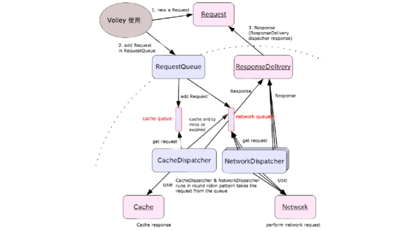
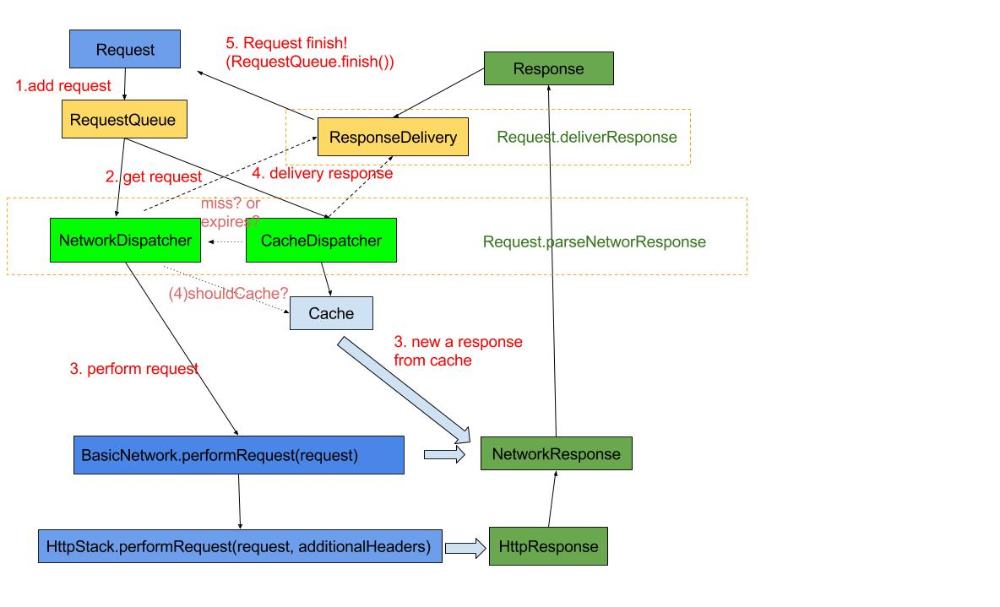

## Volley
> [Volley源码解析](http://a.codekk.com/detail/Android/grumoon/Volley%20%E6%BA%90%E7%A0%81%E8%A7%A3%E6%9E%90)
### What's Volley
> `Volley : a burst of emission of many things or a large amount at once In Google IO’s speech.Easy, Fast Networking for Android`

### Volley Characteristics
* `Automatic scheduling of network requests.`
* `Multiple concurrent network connections.`
* `Transparent disk and memory response caching with standard HTTP cache coherence.`
* `Support for request prioritization.`
* `Cancellation request API.`
*` Ease of customization, for example, for retry and backoff.`
* `Strong ordering that makes it easy to correctly populate your UI with data fetched asynchronously from the network.`
* `Debugging and tracing tools.`
### Volley 设计结构
>上面是 Volley 的总体设计图，主要是通过两种Dispatch Thread不断从RequestQueue中取出请求，根据是否已缓存调用Cache或Network这两类数据获取接口之一，从内存缓存或是服务器取得请求的数据，然后交由ResponseDelivery去做结果分发及回调处理。

### Volley中的概念:
* `Volley`：Volley 对外暴露的 API，通过 `newRequestQueue`(…) 函数新建并启动一个请求队列`RequestQueue`。
* Request：表示一个请求的抽象类。`StringRequest`、`JsonRequest`、`ImageRequest` 都是它的子类，表示某种类型的请求。
* `RequestQueue`：表示请求队列，里面包含一个`CacheDispatcher`(用于处理走缓存请求的调度线程)、`NetworkDispatcher数组`(用于处理走网络请求的调度线程)，`一个ResponseDelivery`(返回结果分发接口)，通过 start() 函数启动时会启动`CacheDispatcher`和`NetworkDispatchers`。
* `CacheDispatcher`：一个线程，用于调度处理走缓存的请求。启动后会不断从缓存请求队列中取请求处理，队列为空则等待，请求处理结束则将结果传递给`ResponseDelivery`去执行后续处理。当结果未缓存过、缓存失效或缓存需要刷新的情况下，该请求都需要重新进入`NetworkDispatcher`去调度处理。
* `NetworkDispatcher`：一个线程，用于调度处理走网络的请求。启动后会不断从网络请求队列中取请求处理，队列为空则等待，请求处理结束则将结果传递给`ResponseDelivery`去执行后续处理，并判断结果是否要进行缓存。
* `ResponseDelivery`：返回结果分发接口，目前只有基于`ExecutorDelivery`的在入参 handler 对应线程内进行分发。
* `HttpStack`：处理 Http 请求，返回请求结果。目前 Volley 中有基于 `HttpURLConnection` 的HurlStack和 基于 `Apache HttpClient` 的HttpClientStack。
* `Network`：调用`HttpStack`处理请求，并将结果转换为可被`ResponseDelivery`处理的`NetworkResponse`。
* `Cache`：缓存请求结果，Volley 默认使用的是基于 sdcard 的`DiskBasedCache`。`NetworkDispatcher`得到请求结果后判断是否需要存储在 Cache，`CacheDispatcher`会从 Cache 中取缓存结果。
### How it works

### Volley core
* Prioritization(DFAULT-FIFO)
	* Low
	* Normal
	* High
	* Immediate

* Cache
	* BaseDiskCache
		* LinkedHashMap--Lru
		* key-value url--CacheHeader
		* use file store data
	* Clear cache
		* RequeueQueue.getCache().clear()/remove(key)
	* Use cache
		* Request setShouldCache(true)

* RetryPolicy
	* interface RetryPolicy
	* DefaultRetryPolicy
		* time out ms
		* max retry number
		* backoff multiplier
	* Use RetryPolicy
		* Request   setRetryPolicy(RetryPolicy  rp)

* Requset Cancellation
### 核心类Volley
* 作用构建一个可用于添加网络请求的RequestQueue对象
* 主要函数:
	* `public static RequestQueue newRequestQueue(Context context)`

	* `public static RequestQueue newRequestQueue(Context context, HttpStack stack)`
	* 第一个方法调用第二个方法, 传Httpstack为null
	* 第二个方法中,如果httpstack为null,如果系统在Gingerbread及之后(即API Level>=9),采用基于HttpUrlConnection的HurlStack,如果小于9,采用基于HttpClient的HttpClientStack
		
			if (stack == null) {
			    if (Build.VERSION.SDK_INT >= 9) {
			        stack = new HurlStack();
			    } else {
			        stack = new HttpClientStack(AndroidHttpClient.newInstance(userAgent));
			    }
			}
	* 得到HttpStack后,构建一个NetWork的具体事项BasicNetWork和一个代表缓存的基于Disk的具体实现DiskBaseCache,最后将网络(NetWork)对象和缓存(Cache)对象传入构建一个RequestQueue,启动这个RequestQueue并返回.
	
			Network network = new BasicNetwork(stack);
			RequestQueue queue = new RequestQueue(new DiskBasedCache(cacheDir), network);
			queue.start();
			return queue;
* HttpURLConnection 和 AndroidHttpClient(HttpClient 的封装)如何选择及原因：
	* 在 Froyo(2.2) 之前，HttpURLConnection 有个重大 Bug，调用 close() 函数会影响连接池，导致连接复用失效，所以在 Froyo 之前使用 HttpURLConnection 需要关闭 keepAlive。
	* 另外在 Gingerbread(2.3) HttpURLConnection 默认开启了 gzip 压缩，提高了 HTTPS 的性能，Ice Cream Sandwich(4.0) HttpURLConnection 支持了请求结果缓存。
	* 再加上 HttpURLConnection 本身 API 相对简单，所以对 Android 来说，在 2.3 之后建议使用 HttpURLConnection，之前建议使用 AndroidHttpClient。

* 关于 User Agent
	* 通过代码我们发现如果是使用 AndroidHttpClient，Volley 还会将请求头中的 User-Agent 字段设置为 App 的 ${packageName}/${versionCode}，如果异常则使用 "volley/0"，不过这个获取 User-Agent 的操作应该放到 if else 内部更合适。而对于 HttpURLConnection 却没有任何操作，为什么呢？如果用 Fiddler 或 Charles 对数据抓包我们会发现，我们会发现 HttpURLConnection 默认是有 User-Agent 的，类似：
	
			Dalvik/1.6.0 (Linux; U; Android 4.1.1; Google Nexus 4 - 4.1.1 - API 16 - 768x1280_1 Build/JRO03S)

	* 经常用 WebView 的同学会也许会发现似曾相识，是的，WebView 默认的 User-Agent 也是这个。实际在请求发出之前，会检测 User-Agent 是否为空，如果不为空，则加上系统默认 User-Agent。在 Android 2.1 之后，我们可以通过
	
			String userAgent = System.getProperty("http.agent");

	* 得到系统默认的 User-Agent，Volley 如果希望自定义 User-Agent，可在自定义 Request 中重写 getHeaders() 函数
	
			@Override
			public Map<String, String> getHeaders() throws AuthFailureError {
			    // self-defined user agent
			    Map<String, String> headerMap = new HashMap<String, String>();
			    headerMap.put("User-Agent", "android-open-project-analysis/1.0");
			    return headerMap;
			}

### 核心类Request
* 代表一个网络请求的抽象类。我们通过构建一个Request类的非抽象子类(StringRequest、JsonRequest、ImageRequest 或自定义)对象，并将其加入到·RequestQueue·中来完成一次网络请求操作。
* Volley 支持 8 种 Http 请求方式 GET, POST, PUT, DELETE, HEAD, OPTIONS, TRACE, PATCH
* Request 类中包含了请求 url，请求请求方式，请求 Header，请求 Body，请求的优先级等信息。
* 因为是抽象类，子类必须重写的两个方法。

    `abstract protected Response<TparseNetworkResponse(NetworkResponse response);`
	> 子类重写此方法，将网络返回的原生字节内容，转换成合适的类型。此方法会在工作线程中被调用。
	
	`abstract protected void deliverResponse(T response);`
	> 子类重写此方法，将解析成合适类型的内容传递给它们的监听回调。
* 以下两个方法也经常会被重写

	`public byte[] getBody()`
	> 重写此方法，可以构建用于 POST、PUT、PATCH 请求方式的 Body 内容。
	
	`protected Map<String, String> getParams()`
	> 在上面getBody函数没有被重写情况下，此方法的返回值会被 key、value 分别编码后拼装起来转换为字节码作为 Body 内容。
### Volley works

### 核心类RequestQueue
* 主要成员变量
	* RequestQueue 中维护了两个基于优先级的 Request 队列，缓存请求队列和网络请求队列。放在缓存请求队列中的 Request，将通过缓存获取数据；放在网络请求队列中的 Request，将通过网络获取数据。
	
			`private final PriorityBlockingQueue<Request<?>> mCacheQueue = new PriorityBlockingQueue<Request<?>>();`
			`private final PriorityBlockingQueue<Request<?>> mNetworkQueue = new PriorityBlockingQueue<Request<?>>();`
	* 维护了一个正在进行中，尚未完成的请求集合。
	
			`private final Set<Request<?>> mCurrentRequests = new HashSet<Request<?>>();`
	* 维护了一个等待请求的集合，如果一个请求正在被处理并且可以被缓存，后续的相同 url 的请求，将进入此等待队列。

    		`private final Map<String, Queue<Request<?>>> mWaitingRequests = new HashMap<String, Queue<Request<?>>>();`
* 启动队列
	* 创建出 RequestQueue 以后，调用 start 方法，启动队列。
	
			/**
			 * Starts the dispatchers in this queue.
			 */
			public void start() {
			    stop();  // Make sure any currently running dispatchers are stopped.
			    // Create the cache dispatcher and start it.
			    mCacheDispatcher = new CacheDispatcher(mCacheQueue, mNetworkQueue, mCache, mDelivery);
			    mCacheDispatcher.start();
			
			    // Create network dispatchers (and corresponding threads) up to the pool size.
			    for (int i = 0; i < mDispatchers.length; i++) {
			        NetworkDispatcher networkDispatcher = new NetworkDispatcher(mNetworkQueue, mNetwork,
			                mCache, mDelivery);
			        mDispatchers[i] = networkDispatcher;
			        networkDispatcher.start();
			    }
			}
	* start 方法中，开启一个缓存调度线程CacheDispatcher和 n 个网络调度线程NetworkDispatcher，这里 n 默认为 4，存在优化的余地，比如可以根据 CPU 核数以及网络类型计算更合适的并发数。缓存调度线程不断的从缓存请求队列中取出 Request 去处理，网络调度线程不断的从网络请求队列中取出 Request 去处理。
* 加入请求

		public <T> Request<T> add(Request<T> request);

* 请求完成

		void finish(Request<?> request)

	Request 请求结束

		(1). 首先从正在进行中请求集合mCurrentRequests中移除该请求。
		(2). 然后查找请求等待集合mWaitingRequests中是否存在等待的请求，如果存在，则将等待队列移除，并将等待队列所有的请求添加到缓存请求队列中，让缓存请求处理线程CacheDispatcher自动处理。
* 请求取消

		public void cancelAll(RequestFilter filter)
		public void cancelAll(final Object tag)

	取消当前请求集合中所有符合条件的请求。
	filter 参数表示可以按照自定义的过滤器过滤需要取消的请求。
	tag 表示按照Request.setTag设置好的 tag 取消请求，比如同属于某个 Activity 的。

### 核心类NetworkDisPatcher

* 一个线程，用于调度处理走网络的请求。启动后会不断从网络请求队列中取请求处理，队列为空则等待，请求处理结束则将结果传递给 ResponseDelivery 去执行后续处理，并判断结果是否要进行缓存。
* 成员变量
	* BlockingQueue<Request<?>> mQueue 网络请求队列
	* Network mNetwork 网络类，代表了一个可以执行请求的网络
	* Cache mCache 缓存类，代表了一个可以获取请求结果，存储请求结果的缓存
	* ResponseDelivery mDelivery 请求结果传递类，可以传递请求的结果或者错误到调用者

* 处理流程图:

 

## How CacheDispatcher works
* 一个线程，用于调度处理走缓存的请求。启动后会不断从缓存请求队列中取请求处理，队列为空则等待，请求处理结束则将结果传递给ResponseDelivery 去执行后续处理。当结果未缓存过、缓存失效或缓存需要刷新的情况下，该请求都需要重新进入NetworkDispatcher去调度处理。
* 成员变量

	* BlockingQueue<Request<?>> mCacheQueue 缓存请求队列
	* BlockingQueue<Request<?>> mNetworkQueue 网络请求队列
	* Cache mCache 缓存类，代表了一个可以获取请求结果，存储请求结果的缓存
	* ResponseDelivery mDelivery 请求结果传递类
	
* 处理流程图

###核心类Cache
> 缓存接口，代表了一个可以获取请求结果，存储请求结果的缓存。
* 主要方法：

	* public Entry get(String key); 通过 key 获取请求的缓存实体
	* public void put(String key, Entry entry); 存入一个请求的缓存实体
	* public void remove(String key); 移除指定的缓存实体
	* public void clear(); 清空缓存
* 代表缓存实体的内部类 Entry
	>成员变量和方法

	* `byte[] data `请求返回的数据（Body 实体）
	* `String etag Http` 响应首部中用于缓存新鲜度验证的 ETag
	* `long serverDate Http` 响应首部中的响应产生时间
	* `long ttl` 缓存的过期时间
	* `long softTtl` 缓存的新鲜时间
	* `Map<String, String> responseHeaders` 响应的 Headers
	* `boolean isExpired()` 判断缓存是否过期，过期缓存不能继续使用
	* `boolean refreshNeeded()` 判断缓存是否新鲜，不新鲜的缓存需要发到服务端做新鲜度的检测
### 核心类 DiskBasedCache.java
> 继承 Cache 类，基于 Disk 的缓存实现类。

* 主要方法：

	* `public synchronized void initialize()` 初始化，扫描缓存目录得到所有缓存数据摘要信息放入内存。
	* `public synchronized Entry get(String key)` 从缓存中得到数据。先从摘要信息中得到摘要信息，然后读取缓存数据文件得到内容。
	* `public synchronized void put(String key, Entry entry)` 将数据存入缓存内。先检查缓存是否会满，会则先删除缓存中部分数据，然后再新建缓存文件。
	* `private void pruneIfNeeded(int neededSpace)` 检查是否能再分配 neededSpace 字节的空间，如果不能则删除缓存中部分数据。
	* `public synchronized void clear()` 清空缓存。 
	* `public synchronized void remove(String key)` 删除缓存中某个元素。
* CacheHeader 类
	* `CacheHeader` 是缓存文件摘要信息，存储在缓存文件的头部，与上面的Cache.Entry相似。
4.2.8 NoCache.java

### Volley_UML

## Response

### Response_Process

