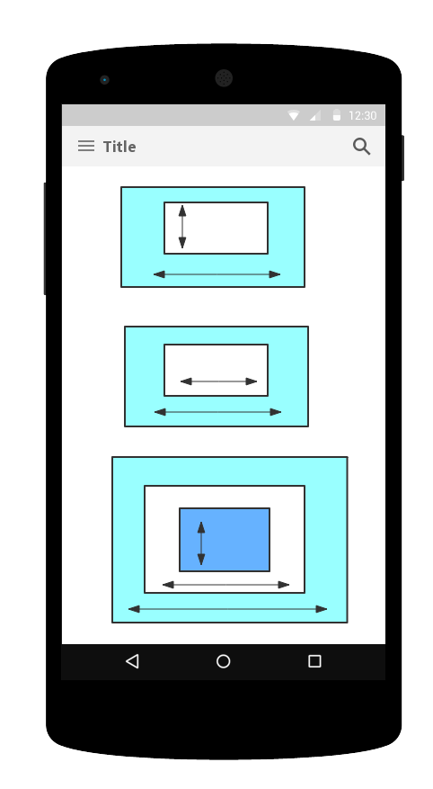

### 实现滑动的方式:
> 实现view的滑动,本质上说都是改变view的坐标,不管是哪种方式实现滑动,实现的基本思想是一致的,当触摸View时,系统记下当前触摸点的坐标,当手指移动时,系统记下移动后的触摸点坐标,获取滑动的偏移量,并通过偏移量来修改View的坐标,不断重复,实现滑动过程.

* layout方法:
> View绘制时,会调用onLayout()方法来设置显示的位置,同样,也可以修改View的left,top,right,bottom四个属性来控制View的坐标.

```java
	@override
	public boolean onTouchEvent(MotionEvent ev){
		int rawX=(int)ev.getRawX();
		int rawY= (int)ev.getRawY();
		
		switch(ev.getAction()){
			case MotionEvent.ACTION_DOWN:
				//记录触摸点坐标
				lastX=rawX;
				lastY=rawY;
				break;
			case MotionEvent.ACTION_MOVE:
				//计算偏移量
				int offsetX= rawX-lastX;
				int offsetY=rawY-lastY;
				//重新布局
				layout(getLeft()+offsetX,getTop()+offsetY,getRight+offsetX,getBottom()+offsetY);
				//重置初始坐标点
				lastX=rawX;
				lastY=rawY;
				break;
			}
			return true;
		}


```

* offsetLeftAndRight()与offsetTopAndBotton()方式
> 这两个方法其实就系统对上下左右移动API的封装,其本质还是完成View的重新布局,效果与layout()一样.

```java

	//同时对left和right进行偏移
	offsetLeftAndRight(offsetX);
	//同时对top和bottom进行偏移
	offsetTopAndBottom(offsetY);

```

* LayoutParams
> LayoutParams保存了View的布局参数,通过改变LayoutParams来动态改变一个布局的位置参数,从而改变View的位置效果.通过LayoutParams方式改变View的布局,本质上是改变View的Margin属性,所以也可以通过改变MarginLayoutParams来实现.

```java
	
	LinnerLayout.LayoutParams params= (LinearLayout.LayoutParams)getLayoutParams();
	params.leftMargin=getLeft()+offsetX;
	params.topMargin=getTop()+offsetY;
	setLayoutParams(params);

	//或者直接使用MarginLayoutParams
	ViewGroup.MarginLayoutParams params= (ViewGroup.MarginLayoutParam)getLayoutParams();
	params.leftMargin=getLeft()+offsetX;
	params.topMargin=getTop()+offsetY;
	setLayoutParams(params);

```

* scrollTo()与scrollBy()
> scrollTo()是指View的绝对坐标的移动,而ScrollBy则是View的相对坐标的移动.另外scrollTo()与scollBy()方法移动的仅仅是View的内容,而不是View本身,这点要注意.


	*  如果要移动View,应该找到View所在ViewGroup,调用如下代码:

	```java
	
		((View)getParent).scrollTo(x,y);
	
	```

	*  scrollTo()与scrollBy()滑动都是一瞬间完成,显得太突兀,可以考虑和Scroller联合使用.

* 动画
	> 使用动画应该注意Property Animation与View Animation的区别.


### 滑动冲突的处理



* 滑动冲突主要为三种场景:
	* 外部滑动方向和内部滑动方向不一致
	* 外部滑动方向和内部滑动方向一致
	* 嵌套上面两种情况

* 处理冲突的规则:
	* 对于外部滑动方向和内部滑动方向不一致情况,处理规则:当用户左右滑动时,需要让外部的View拦截点击事件,当用户上下滑动滑动时,需要让内部的View的拦截点击事件.具体点:谁需要滑动,谁就去拦截点击事件.
	* 对于场景2,无法从滑动的角度,距离差,速度差来判断,一般都能在业务上找到突破点,比如当处于某种状态时需要外部View响应用户,而处于另一种状态时,需要内部View来响应View的滑动.
	* 对于场景3,也是从业上寻找突破点,根据不同的情况实现不同的事件拦截即可.


* 处理滑动冲突的解决方式:
	* 外部拦截法:
	* 内部拦截法:

#### 外部拦截法:
> 外部拦截法是指事件都先经过父容器的拦截处理,如果父容器需要此事件就去拦截,如果不需要就不拦截,外部拦截法需要重写父容器的`onInterceptTouchEvent()`方法,在内部做出相应的拦截即可.

```java
	
	public boolean onInterceptTouchEvent(MotionEvent ev){
		boolean intercepted=false;
		int x= (int)event.getX();
		int y= (int)event.getY();
		switch(evnet.getAction){
			case MotionEvent.ACTION_DOWN:
			//Action_down必须要返回false,一旦父容器拦截了ACTION_DOWN,那么后续的ACTION_MOVE和ACTION_UP事件都会交给父容器处理.
				intercepted=false;
				break;
			case MotionEvent.ACTION_MOVE:
				if(父容器需要当前点击事件){
					intercepted=true;
				}else{
					intercepted=false;
				}
				break;
			case MotionEvent.ACTION_UP:
				intercepted=false;
				break;
		}
		mLastXIntercept=x;
		mLastYIntercept=y;
		return intercepted;
	}

```

#### 内部拦截法
> 内部拦截法,指父容器不拦截任何事件,所有的事件都传递给子元素,如果子元素需要就消费事件,否则交给父容器处理,这种方式需要配合`requestDiasllowInterceptTouchEvent()`才能正常进行,伪代码如下:

```java
	
	public boolean onInterceptTouchEvent(MotionEvent ev){
		boolean intercepted=false;
		int x= (int)event.getX();
		int y= (int)event.getY();
		switch(evnet.getAction){
			case MotionEvent.ACTION_DOWN:
				//请求父容器不拦截
				parent.requestDiasllowInterceptTouchEvent(true)
				break;
			case MotionEvent.ACTION_MOVE:
				int deltaX=x-mLastX;
				int deltaY=y-mLastY;
				if(父容器需要当前点击事件){
					//请求拦截
					parent.requestDiasllowInterceptTouchEvent(false);
				}else{
					
				}
				break;
			case MotionEvent.ACTION_UP:
		
				break;
		}
		mLastXIntercept=x;
		mLastYIntercept=y;
		return super.dispatchTouchEvent(event);
	}

```

除了子元素需要处理外,父元素也要做相应的处理,拦截除了ACTION_DOWN以外的其他事件,这样子元素才能调用`requestDiasllowInterceptTouchEvent(false)`时,父元素才能拦截所需的事件:

```java

	public boolean onInterceptTouchEvent(MotionEvent ev){
		if(evnet.getAction==MotionEvent.ACTION_DOWN){
			return true;
		}else{
			return false;
		}
	}
	

```

为什么父容器不能拦截`ACTION_DOWN`事件呢?因为`ACTION_DOWN`事件并不受`FLAG_DISALLOW_INTERCEPT`这个标记控制,所以父容器拦截`ACTION_DOWN`事件,那么所有的事件都无法传递到子元素中去.这样内部拦截就无法起作用了.
