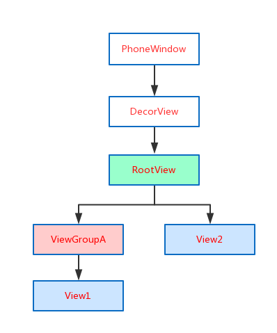
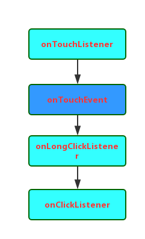

### 为什么要有事件传递:
* 我们知道View是树形结构,当Touch事件(TouchEvent)产生时,可以有多个View去响应,那么为了解决到底哪个View消费这个Touch事件,就出现了事件传递机制.
* View结构图如下:



### 处理事件传递相关方法:

* `boolean dispatchTouchEvent(MotionEvent ev)`
	> 用来进行事件的分发.如果事件能够传递到当前View,该方法一定会调用,返回值受当前View的onTouchEvent和下级View的dispatchTouchEvent()影响,表示是否消费当前事件.

* `boolean onInterceptTouchEvent(MotionEvent ev)`
	> 在dispatchTouchEvent()内部调用,用来判是否拦截某个事件,返回结果表示是否拦截当前事件.

* `boolean onTouchEvent(MotionEvent ev)`
	> 在dispatchTouchEvent()中调用,用来处理点击事件,返回结果受当前事件是否消费.

* 上述三个方法可以用一段伪代码来表示其关系:

```java

	public boolean dispatchTouchEvent(MotionEvent ev){
		boolean consume=false;
		if(onInterceptTouchEvent(ev)){
			consume=onTouchEvent(ev);
		}else{
			consume= child.dispatchTouchEvent(ev);
		}
		return consume;
	}
```

* 上述三个方法在Activity,ViewGroup,View中的存在关系:
| 类型 |相关方法  | Activity |ViewGroup |View |
| :------------ |:---------------:| -----:| -----:| -----:|
| 事件分发     | dispatchTouchEvent | √ | √| √|
| 事件拦截     | onInterceptTouchEvent |X |√| X|
| 事件消费     | onTouchEvent |√| √| √|


### 事件传递消费的顺序:
*　当一个事件触发时，事件的流程：
	｀Activity->PhoneWindow->DecorView->ViewGroup->...->View｀

* 若最上层的View也没消费事件,事件则原路返回给Activity:
	`View->...->ViewGroup->DecorView->PhoneWindow->Activity`

### 事件传递源码分析:

* 点击事件(MotionEvent)首先会传递给当前Activity,当前Activity的dispatchTouchEvent()会进行事件派发,具体工作由Activity内部的window完成,而Window是抽象的,Window的superDispatchTouchEvent()也是抽象,就有Window的唯一子类PhoneWindow处理事件. 
* 我们首先分析Activity的dispatchTouchEvent():显然,首先事件交给Window进行分发,若返回true,整个事件结束,返回false表示没有View处理,那么Activity的OnTouchEvent()会被调用.

```java

	public boolean dispatchTouchEvent(MotionEvent ev) {
        if (ev.getAction() == MotionEvent.ACTION_DOWN) {
            onUserInteraction();
        }
        if (getWindow().superDispatchTouchEvent(ev)) {
            return true;
        }
        return onTouchEvent(ev);
    }
```

* 接着看看PhoneWindow是如果处理事件的: PhoneWindow直接将事件传递给了DecorView:

```java

	@Override
    public boolean superDispatchTouchEvent(MotionEvent event) {
        return mDecor.superDispatchTouchEvent(event);
    }

````

* 而DecorView是FrameLayout的子类,也就将事件传递给了RootView:

```java

     public boolean superDispatchTouchEvent(MotionEvent event) {
        return mDecor.superDispatchTouchEvent(event);
     }
```

--------------

* 　首先ViewGroup对点击事件的分发过程,主要实现在dispatchTouchEvent():
下面这段代码主要判断ViewGroup是否要去拦截事件:


```java

	// Check for interception.
       final boolean intercepted;
       if (actionMasked == MotionEvent.ACTION_DOWN
              || mFirstTouchTarget != null) {
           final boolean disallowIntercept = (mGroupFlags & FLAG_DISALLOW_INTERCEPT) != 0;
           if (!disallowIntercept) {
              intercepted = onInterceptTouchEvent(ev);
              ev.setAction(action); // restore action in case it was changed
            } else {
                 intercepted = false;
            }
        } else {
           // There are no touch targets and this action is not an initial down
            // so this view group continues to intercept touches.
            intercepted = true;
        }

	```

* ViewGroup会在两种情况下判断是否要拦截当前事件:事件类型类为ACTION_DOWN或者mFirstTouchTarget!=null,而mFirstTouchTarget的值取决于子View是否消费事件,如果子View不消费事件则mFirstTouchTarget!=null就不成立了.那么ACTION_MOVE或者ACTION_UP时,onInterceptTouchEvent()就不会调用了.

*  当然还有一种特殊情况,就是FLAG_DISALLOW_INTERCEPT标记,这个子View通过requestDisallowInterceptTouchEvent()来设置,一旦设置ViewGroup将无法拦截除ACTION_DOWN以外的其他事件,因为在ACTION_DOWN时会重置FLAG_DISALLOW_INTERCEPT这个标记的值,因此当ACTION_DOWN时,ViewGroup总会调用onInterceptTouchEvent()来询问是否拦截事件.

*  下面这段代码会在ACTION_DOWN时重置FLAG标记的值:ViewGroup决定拦截后,那么后续的点击事件默认交给他处理,并不调用onInterceptTouchEvent().

```java

		// Handle an initial down.
            if (actionMasked == MotionEvent.ACTION_DOWN) {
                // Throw away all previous state when starting a new touch gesture.
                // The framework may have dropped the up or cancel event for the previous gesture
                // due to an app switch, ANR, or some other state change.
                cancelAndClearTouchTargets(ev);
                resetTouchState();
            }
```

----------
* 接着看ViewGroup不拦截事件情况:

```java

  		if (!canceled && !intercepted) {
                if (actionMasked == MotionEvent.ACTION_DOWN
                        || (split && actionMasked == MotionEvent.ACTION_POINTER_DOWN)
                        || actionMasked == MotionEvent.ACTION_HOVER_MOVE) {
                    final int actionIndex = ev.getActionIndex(); // always 0 for down
                    final int idBitsToAssign = split ? 1 << ev.getPointerId(actionIndex)
                            : TouchTarget.ALL_POINTER_IDS;

                    // Clean up earlier touch targets for this pointer id in case they
                    // have become out of sync.
                    removePointersFromTouchTargets(idBitsToAssign);

                    final int childrenCount = mChildrenCount;
                    if (newTouchTarget == null && childrenCount != 0) {
                        final float x = ev.getX(actionIndex);
                        final float y = ev.getY(actionIndex);
                        // Find a child that can receive the event.
                        // Scan children from front to back.
                        final ArrayList<View> preorderedList = buildOrderedChildList();
                        final boolean customOrder = preorderedList == null
                                && isChildrenDrawingOrderEnabled();
                        final View[] children = mChildren;
                        for (int i = childrenCount - 1; i >= 0; i--) {
                            final int childIndex = customOrder
                                    ? getChildDrawingOrder(childrenCount, i) : i;
                            final View child = (preorderedList == null)
                                    ? children[childIndex] : preorderedList.get(childIndex);

                            // If there is a view that has accessibility focus we want it
                            // to get the event first and if not handled we will perform a
                            // normal dispatch. We may do a double iteration but this is
                            // safer given the timeframe.
                            if (childWithAccessibilityFocus != null) {
                                if (childWithAccessibilityFocus != child) {
                                    continue;
                                }
                                childWithAccessibilityFocus = null;
                                i = childrenCount - 1;
                            }

                            if (!canViewReceivePointerEvents(child)
                                    || !isTransformedTouchPointInView(x, y, child, null)) {
                                ev.setTargetAccessibilityFocus(false);
                                continue;
                            }

                            newTouchTarget = getTouchTarget(child);
                            if (newTouchTarget != null) {
                                // Child is already receiving touch within its bounds.
                                // Give it the new pointer in addition to the ones it is handling.
                                newTouchTarget.pointerIdBits |= idBitsToAssign;
                                break;
                            }

                            resetCancelNextUpFlag(child);
                            if (dispatchTransformedTouchEvent(ev, false, child, idBitsToAssign)) {
                                // Child wants to receive touch within its bounds.
                                mLastTouchDownTime = ev.getDownTime();
                                if (preorderedList != null) {
                                    // childIndex points into presorted list, find original index
                                    for (int j = 0; j < childrenCount; j++) {
                                        if (children[childIndex] == mChildren[j]) {
                                            mLastTouchDownIndex = j;
                                            break;
                                        }
                                    }
                                } else {
                                    mLastTouchDownIndex = childIndex;
                                }
                                mLastTouchDownX = ev.getX();
                                mLastTouchDownY = ev.getY();
                                newTouchTarget = addTouchTarget(child, idBitsToAssign);
                                alreadyDispatchedToNewTouchTarget = true;
                                break;
                            }
						//....
                    }                  

```

* 首先是遍历ViewGroup的所有子元素,判断子元素能否接受到点击事件,能否接受点击事件由两点衡量:子元素是否在播放动画和点击事件的坐标是否落在子元素的区域内.可以看到dispatchTransformTouchEvent()实际上是调用子元素的dispatchTouchEvent():

```java

	if (child == null) {
           handled = super.dispatchTouchEvent(event);
     } else {
           handled = child.dispatchTouchEvent(event);
     }

```

* 如果子元素dispatchTouchEvent()返回true,则mFirstTouchTarget就是会被赋值跳出循环:

```java

	newTouchTarget = addTouchTarget(child, idBitsToAssign);
	alreadyDispatchedToNewTouchTarget = true;
	break;

```

* 显然,mFirstTouchTarget的赋值是在addTouchTarget()内部完成的,从方法内部可以看出TouchTarget其实是一种单链表结构,mFirstTouchTarget是否赋值将直接影响ViewGroup对时间的拦截策略.

```java

	private TouchTarget addTouchTarget(View child, int pointerIdBits) {
	        TouchTarget target = TouchTarget.obtain(child, pointerIdBits);
	        target.next = mFirstTouchTarget;
	        mFirstTouchTarget = target;
	        return target;
	}


```

* 如果子View都没有处理事件,ViewGroup将自己处理点击事件:dispatchTransformTouchEvent()在child为null时,调用View的dispatchTouchEvent(),这时事件就交给了View的dispatchTouchEvent()处理了.

```java

	// Dispatch to touch targets.
    if (mFirstTouchTarget == null) {
        // No touch targets so treat this as an ordinary view.
        handled = dispatchTransformedTouchEvent(ev, canceled, null,TouchTarget.ALL_POINTER_IDS);
	}

```

----------------

* View的dispatchTouchEvent()对事件处理的代码如下:很显然,View对点击事件的处理,会先判断有没有设置OnTouchListener,若onTouch返回true,那么onTouchEvent()不会被调用.

```java
	
	public boolean dispatchTouchEvent(MotionEvent event) {
		//...
        if (onFilterTouchEventForSecurity(event)) {
            //noinspection SimplifiableIfStatement
            ListenerInfo li = mListenerInfo;
            if (li != null && li.mOnTouchListener != null&& (mViewFlags & ENABLED_MASK) == ENABLED
                    && li.mOnTouchListener.onTouch(this, event)) {
                result = true;
            }

            if (!result && onTouchEvent(event)) {
                result = true;
            }
        }

      //....
        return result;
    }

```java

* 接着分析View的onTouchEvent()方法:显然,即便View处于不可用状态下,事件也可以被消费掉.

```

	 if ((viewFlags & ENABLED_MASK) == DISABLED) {
	            if (action == MotionEvent.ACTION_UP && (mPrivateFlags & PFLAG_PRESSED) != 0) {
	                setPressed(false);
	            }
	            // A disabled view that is clickable still consumes the touch
	            // events, it just doesn't respond to them.
	            return (((viewFlags & CLICKABLE) == CLICKABLE
	                    || (viewFlags & LONG_CLICKABLE) == LONG_CLICKABLE)
	                    || (viewFlags & CONTEXT_CLICKABLE) == CONTEXT_CLICKABLE);
	}


```

* 接着如果View设置有代理,那么会执行TouchDelegate的onTouchEvent():

```java

	if (mTouchDelegate != null) {
	            if (mTouchDelegate.onTouchEvent(event)) {
	                return true;
	            }
	 }
```

* 接着看看OnTouchEvent()如何处理点击事件:只要有一个View的CLICKABLE和LONG_CLICKABLE为true,那么就会消费这个事件,当ACTION_UP事件发生时,会触发performClick(),如果设置了onClickLisetener,那么会调用onClick().

```java

        if (((viewFlags & CLICKABLE) == CLICKABLE ||
                (viewFlags & LONG_CLICKABLE) == LONG_CLICKABLE) ||
                (viewFlags & CONTEXT_CLICKABLE) == CONTEXT_CLICKABLE) {
            switch (action) {
                case MotionEvent.ACTION_UP:
                    boolean prepressed = (mPrivateFlags & PFLAG_PREPRESSED) != 0;
                    if ((mPrivateFlags & PFLAG_PRESSED) != 0 || prepressed) {                	
						//....
                        if (!mHasPerformedLongPress && !mIgnoreNextUpEvent) {
                            // This is a tap, so remove the longpress check
                            removeLongPressCallback();

                            if (!focusTaken) {
                                if (mPerformClick == null) {
                                    mPerformClick = new PerformClick();
                                }
                                if (!post(mPerformClick)) {
                                    performClick();
                                }
                            }
                        }

```

* 综上所述,和View事件相关的方法执行优先级如下:


