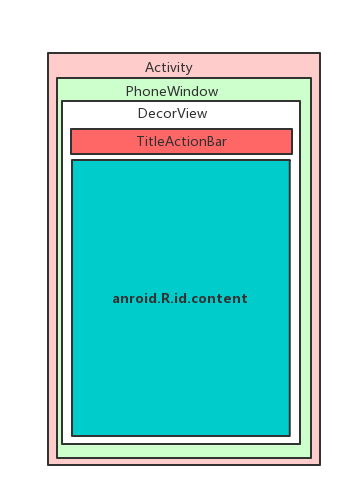
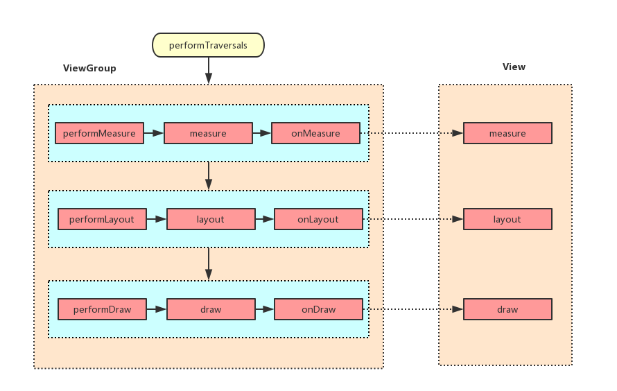
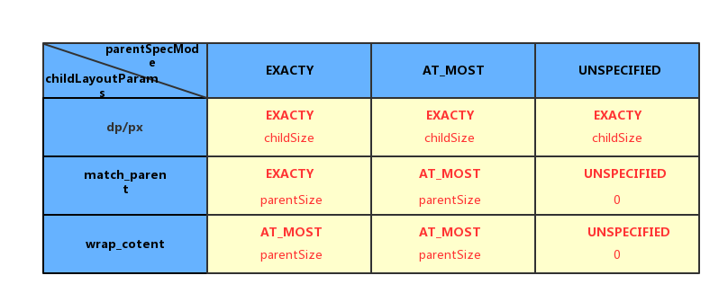

## 自定义View之测量篇

### 初识ViewRoot和ViewRootImpl

我们知道,Activity界面加载显示的流程具体如下图,其中`android.R.id.content`就是View布局,这也就说明Activity中setContentView()而不叫setView()了,当然也可以通过`ViewGroup content= (ViewGroup)findViewById(android.R.id.content)`可以获取content,那么我们设置的View就可以通过`content.getChildAt(0)`来获取了.




ViewRoot对应于`ViewRootImp`l类,他是连接`WindowManager`和`DecorView`的纽带,View绘制的三大流程均是通过ViewRoot来完成.在ActivityThread中,当Activity对象被创建,会将DecorView添加到Window中,同时会创建ViewRootImpl对象,并将ViewRootImpl对象和DecorView关联,如下代码:

```java

	root=new ViewRootImpl(view.getContext(),display);
	root.setView(view,wparams,panelParentView);

```

View的绘制流程是从ViewRoot的performTraversals()开始,经过measure,layout,draw三个过程才能将View绘制出来,其中measure用来测量View的宽和高,layout用来确定View在父容器中位置,draw将View绘制在屏幕上.performalTraversals()大致流程如下:




### 理解MeasureSpec

MeasureSpec代表一个32位的int值,高2为代表SpecMode,而后30代表SpecSize,SpecMode代表测量模式,SpecSize表示在某种测量模式下的规格大小,如MeasureSpec内部定义的常量:

```java
	
	private static final int MODE_SHIFT = 30;
    private static final int MODE_MASK  = 0x3 << MODE_SHIFT;
	public static final int UNSPECIFIED = 0 << MODE_SHIFT;
    public static final int EXACTLY     = 1 << MODE_SHIFT;
    public static final int AT_MOST     = 2 << MODE_SHIFT;
	
	public static int makeMeasureSpec( int size, int mode) {
            if (sUseBrokenMakeMeasureSpec) {
                return size + mode;
            } else {
                return (size & ~MODE_MASK) | (mode & MODE_MASK);
            }
    }

    public static int getMode(int measureSpec) {
            //noinspection ResourceType
            return (measureSpec & MODE_MASK);
    }

    public static int getSize(int measureSpec) {
            return (measureSpec & ~MODE_MASK);
    }
```

MeasureSpec中MeasureMode有三类:

* UNSPECIFIED
	> 父容器不对View有任何限制,要多大给多大,一般用于系统内部,表示一种测量状态.
* EXACTLY
	> 精确测量,View的大小就是SpecSize,对应于match_parent和具体数值.
* AT_MOST
	> 对应于LayoutParams中的wrap_content.


### MeasureSpec与LayoutParams的对应关系

系统内部是通过MeasureSpec来进行View的测量,但是正常情况下我们使用View指定MeasureSpec,尽管如此,可以给View指定LayoutParams,在View进行测量时,系统会将LayoutParams在父容器的约束下转换为对应的MeasureSpec,然后确定View测量后的宽和高,需要注意的是**MeasureSpec不是唯一由LayoutParams决定的,LayoutPrams需要和父容器一起才能确定View的MeasureSpec,进而确定View的测量后的宽和高.**

另外,对于顶级View(DecorView)来说,其MeasureSpec由窗口的尺寸及自身的LayoutParams来共同确定.对于普通View,其MeasureSpec有父容器的MeasureSpec和自身的LayoutParams来共同确定.

对于DecorView来说,ViewRootImpl中measureHierarchy()的有如下代码,展示了DecorViewd的MeasureSpce创建过程,其中desireWindowWidth和desiredWindowHeight为窗口的尺寸.


```java
	
	 childWidthMeasureSpec = getRootMeasureSpec(desiredWindowWidth, lp.width);
	 childHeightMeasureSpec = getRootMeasureSpec(desiredWindowHeight, lp.height);
	 performMeasure(childWidthMeasureSpec, childHeightMeasureSpec);	

```

接着再看,getRootMeasureSpec方法实现:

```java

	private static int getRootMeasureSpec(int windowSize, int rootDimension) {
        int measureSpec;
        switch (rootDimension) {

        case ViewGroup.LayoutParams.MATCH_PARENT:
            // Window can't resize. Force root view to be windowSize.
            measureSpec = MeasureSpec.makeMeasureSpec(windowSize, MeasureSpec.EXACTLY);
            break;
        case ViewGroup.LayoutParams.WRAP_CONTENT:
            // Window can resize. Set max size for root view.
            measureSpec = MeasureSpec.makeMeasureSpec(windowSize, MeasureSpec.AT_MOST);
            break;
        default:
            // Window wants to be an exact size. Force root view to be that size.
            measureSpec = MeasureSpec.makeMeasureSpec(rootDimension, MeasureSpec.EXACTLY);
            break;
        }
        return measureSpec;
    }

```

DecorView的MeasureSpec就确定了,根据其LayoutParams中的宽高参数来划分:

* LayoutParams.MATCH_PARENT:精确模式,大小就是窗口的大小
* LayoutParams.WRAP_CONTENT:最大模式,大小不定,但是不能超过窗口的大小
* 固定大小,精确模式.


对于普通View来说,这里指我们布局中的View,View的measure过程由ViewGroup传递而来,先看ViewGroup的measureChildWidthMargins():

```java

    protected void measureChildWithMargins(View child,
            int parentWidthMeasureSpec, int widthUsed,
            int parentHeightMeasureSpec, int heightUsed) {
        final MarginLayoutParams lp = (MarginLayoutParams) child.getLayoutParams();

        final int childWidthMeasureSpec = getChildMeasureSpec(parentWidthMeasureSpec,
                mPaddingLeft + mPaddingRight + lp.leftMargin + lp.rightMargin
                        + widthUsed, lp.width);
        final int childHeightMeasureSpec = getChildMeasureSpec(parentHeightMeasureSpec,
                mPaddingTop + mPaddingBottom + lp.topMargin + lp.bottomMargin
                        + heightUsed, lp.height);

        child.measure(childWidthMeasureSpec, childHeightMeasureSpec);
    }

```

在对子元素measure前,会通过getChildMeasureSpec得到子元素的MeasureSpec,从代码来看,子元素的MeasureSpec和父容器的MeasureSpec和自身的LayoutParams有关,此外还和View的margins和padding有关.

```java

	public static int getChildMeasureSpec(int spec, int padding, int childDimension) {
        int specMode = MeasureSpec.getMode(spec);
        int specSize = MeasureSpec.getSize(spec);

        int size = Math.max(0, specSize - padding);

        int resultSize = 0;
        int resultMode = 0;

        switch (specMode) {
        // Parent has imposed an exact size on us
        case MeasureSpec.EXACTLY:
            if (childDimension >= 0) {
                resultSize = childDimension;
                resultMode = MeasureSpec.EXACTLY;
            } else if (childDimension == LayoutParams.MATCH_PARENT) {
                // Child wants to be our size. So be it.
                resultSize = size;
                resultMode = MeasureSpec.EXACTLY;
            } else if (childDimension == LayoutParams.WRAP_CONTENT) {
                // Child wants to determine its own size. It can't be
                // bigger than us.
                resultSize = size;
                resultMode = MeasureSpec.AT_MOST;
            }
            break;

        // Parent has imposed a maximum size on us
        case MeasureSpec.AT_MOST:
            if (childDimension >= 0) {
                // Child wants a specific size... so be it
                resultSize = childDimension;
                resultMode = MeasureSpec.EXACTLY;
            } else if (childDimension == LayoutParams.MATCH_PARENT) {
                // Child wants to be our size, but our size is not fixed.
                // Constrain child to not be bigger than us.
                resultSize = size;
                resultMode = MeasureSpec.AT_MOST;
            } else if (childDimension == LayoutParams.WRAP_CONTENT) {
                // Child wants to determine its own size. It can't be
                // bigger than us.
                resultSize = size;
                resultMode = MeasureSpec.AT_MOST;
            }
            break;

        // Parent asked to see how big we want to be
        case MeasureSpec.UNSPECIFIED:
            if (childDimension >= 0) {
                // Child wants a specific size... let him have it
                resultSize = childDimension;
                resultMode = MeasureSpec.EXACTLY;
            } else if (childDimension == LayoutParams.MATCH_PARENT) {
                // Child wants to be our size... find out how big it should
                // be
                resultSize = View.sUseZeroUnspecifiedMeasureSpec ? 0 : size;
                resultMode = MeasureSpec.UNSPECIFIED;
            } else if (childDimension == LayoutParams.WRAP_CONTENT) {
                // Child wants to determine its own size.... find out how
                // big it should be
                resultSize = View.sUseZeroUnspecifiedMeasureSpec ? 0 : size;
                resultMode = MeasureSpec.UNSPECIFIED;
            }
            break;
        }
        //noinspection ResourceType
        return MeasureSpec.makeMeasureSpec(resultSize, resultMode);
    }

```

其主要作用是根据父容器的MeasureSpec和自身LayoutParams确定子元素的MeasureSpec,参数中的padding指父容器的中已占空间大小,子元素可用大小为父容器的尺寸减去padding,具体如下代码:

```java

	int specSize = MeasureSpec.getSize(spec);
    int size = Math.max(0, specSize - padding);	
	
```

最后,总结下普通View的MeasureSpec的创建规则如下表:




### View的绘制流程
View的流程主要是指measure,layout,draw三大流程.

#### measure
measure过程要分情况来看,如果是view,那么通过measure方法即可完成其测量过程,如果是ViewGroup,除了完成自己的测量过程外,还会去遍历调用所有子元素的measure方法,各个元素再递归去执行这个流程.首先看View的测量过程:View的measure()为final,子类不能重写,在View内部会调用View的onMeasure(),因此这需要看onMeausre()即可:

```java

	protected void onMeasure(int widthMeasureSpec, int heightMeasureSpec) {
        setMeasuredDimension(getDefaultSize(getSuggestedMinimumWidth(), widthMeasureSpec),
                getDefaultSize(getSuggestedMinimumHeight(), heightMeasureSpec));
    }

```

再看getDefaultSize(),逻辑很简单,只需要看EXACTLY和AT_MOST,简单理解,getDefaultSize()返回的就是measureSpec中的specSize.

```java

	public static int getDefaultSize(int size, int measureSpec) {
        int result = size;
        int specMode = MeasureSpec.getMode(measureSpec);
        int specSize = MeasureSpec.getSize(measureSpec);

        switch (specMode) {
        case MeasureSpec.UNSPECIFIED:
            result = size;
            break;
        case MeasureSpec.AT_MOST:
        case MeasureSpec.EXACTLY:
            result = specSize;
            break;
        }
        return result;
    }

```

至于UNSPECIFIED这种情况,一般用于系统内部测量,看下getSuggestedMinimumWidht()方法:

```java

	protected int getSuggestedMinimumWidth() {
        return (mBackground == null) ? mMinWidth : max(mMinWidth, mBackground.getMinimumWidth());
    }

```

从代码可以看出,如果View没有设置背景,那么View的宽度为mMinWidth,即为andriod:minWidth属性所指的值,默认为0;如果View设置了背景,则为背景的实际宽度,从下面代码可以看出:

```java

	public int getMinimumWidth() {
        final int intrinsicWidth = getIntrinsicWidth();
        return intrinsicWidth > 0 ? intrinsicWidth : 0;
    }
```

至此,我们知道:直接继承View的自定义控件需要重写onMeasure()并设置wrap_content时自身的大小,否则在布局中使用wrap_content就相当于使用match_parent.这点可由上面的View的measureSpec的创建规则表可知.(具体可以参考ImageView,TextView的系统源码,在wrap_content所做的处理).

对于ViewGroup来说,除了完成自身的measure过程外,还要遍历所有子元素measure(),各个子元素再递归下去,和View不同的是,ViewGroup是个抽象类,没有重写View的onMeasure(),但提供了一个measureChild()方法:

```java

    protected void measureChildren(int widthMeasureSpec, int heightMeasureSpec) {
        final int size = mChildrenCount;
        final View[] children = mChildren;
        for (int i = 0; i < size; ++i) {
            final View child = children[i];
            if ((child.mViewFlags & VISIBILITY_MASK) != GONE) {
                measureChild(child, widthMeasureSpec, heightMeasureSpec);
            }
        }
    }

	

	protected void measureChild(View child, int parentWidthMeasureSpec,
            int parentHeightMeasureSpec) {
        final LayoutParams lp = child.getLayoutParams();

        final int childWidthMeasureSpec = getChildMeasureSpec(parentWidthMeasureSpec,
                mPaddingLeft + mPaddingRight, lp.width);
        final int childHeightMeasureSpec = getChildMeasureSpec(parentHeightMeasureSpec,
                mPaddingTop + mPaddingBottom, lp.height);

        child.measure(childWidthMeasureSpec, childHeightMeasureSpec);
    }

```
显然,measureChild的思想就是取出子元素的LayoutParams,后通过getChildMeasureSpec创建子元素的MeasureSpec,再将MeasureSpec直接传递给View的measure()方法,getChildMeasureSpec在上面已经分析,通过MeasureSpec创建规则表可以很清楚理解.

ViewGroup并没有定义其测量的具体过程,因为ViewGroup是个抽象类.其测量过程的onMeasure()需要各个子类去具体实现,比如LinearLayout,RelativeLayout等等.


如何在Activity中获取View的宽高呢? 由于View的measure过程和Activity的生命周期不同步,因此无法保存在onCreate,onStart,onResume等方法中获取View的宽高,获取View的宽高可以从下面四种方法入手:

* **`Activity/View#onWindowFocusChanged`**
	
	```java
	
		public void onWindowFoucusChanged(boolean hasFocus){
			super.onWindowFocusChanged(hasFocus);
			if(hasFoucs){
				int width= view.getMeasureWidth();
				int height= view.getMeasureHight();
			}
		}
	
	```

*  **`view.post(runnable)`**

	```java

		protected void onStart(){
			view.post(new Runnable(){
				@override
				public void run(){
					int width= view.getMeasureWidth();
					int height= view.getMeasureHight();
				}
			});
		}
		
	```

* **`ViewTreeObserver`**

	```java

		protected void onStart(){
			super.onstart();
			ViewTreeObserver observer= view.getViewTreeObserver();
			observer.addonGloballLayoutLisetener(new onGloballLayoutListener(){
				@override
				public void onGloballLayout(){
					view.getViewTreeObserver().removeGloballLayoutListener(this);
					int width= view.getMeasureWidth();
					int height= view.getMeasureHight();
				}
			});	
		}
	```

* view.measure(int widthMeasureSpec,int heightMeasureSpec)
	> 这种方法不适合view的layoutParams为match_parent,因为构造此MeasureSpec需要知道parentSize,即父容器的剩余空间,这parentSize无法知道,所以不使用.当LayoutParams为wrap_content时,可以使用如下代码:

	```java
		
		int widthMeasureSpec= MeasureSpec.makeMeasureSpec((1<<30)-1,MeasureSpec.AT_MOST);
		int heightMeasureSpec= MeasureSpec.makeMeasureSpec((1<<30)-1,MeasureSpec.AT_MOST);
		view.measure(widthMeasureSpec,heightMeasureSpec);
	```

#### **layout**

Layout的作用是ViewGroup确定子元素的位置,当ViewGroup位置确定后,会去遍历所有子元素并调用其layout(),在layout中会调用onLayout,一直递归下去完成View树的layout过程.

先看ViewGroup的layout方法:

```java

	@Override
    public final void layout(int l, int t, int r, int b) {
        ......
        super.layout(l, t, r, b);
        ......
    }

```
ViewGroup的layout方法实质还是还是调用了View的layout方法,并没有实现,接着再来看看View的layout方法:

```java

	public void layout(int l, int t, int r, int b) {
        ......
        //实质都是调用setFrame方法把参数分别赋值给mLeft、mTop、mRight和mBottom这几个变量
        //判断View的位置是否发生过变化，以确定有没有必要对当前的View进行重新layout
        boolean changed = isLayoutModeOptical(mParent) ?
                setOpticalFrame(l, t, r, b) : setFrame(l, t, r, b);
        //需要重新layout
        if (changed || (mPrivateFlags & PFLAG_LAYOUT_REQUIRED) == PFLAG_LAYOUT_REQUIRED) {
            //回调onLayout
            onLayout(changed, l, t, r, b);
            ......
        }
        ......
    }
	
```

也就是先通过setFrame()方法确定View的四个顶点的位置,确定View在父容器中的位置,接着调用onLayout,和onMeasure()方法类似,onLayout()方法具体实现也和具体的布局有关,所以View和ViewGroup都没有真正实现onLayout().

下面看看LinearLayout的onLayout方法实现:

```java
	
 	@Override
    protected void onLayout(boolean changed, int l, int t, int r, int b) {
        if (mOrientation == VERTICAL) {
            layoutVertical(l, t, r, b);
        } else {
            layoutHorizontal(l, t, r, b);
        }
    }	

	void layoutVertical(int left, int top, int right, int bottom) {
        final int paddingLeft = mPaddingLeft;

        int childTop;
        int childLeft;
        
        // 计算父窗口推荐的子View宽度
        final int width = right - left;
		//计算父窗口推荐子View右侧位置
        int childRight = width - mPaddingRight;
        
        // child可用大小
        int childSpace = width - paddingLeft - mPaddingRight;
        
        final int count = getVirtualChildCount();

        final int majorGravity = mGravity & Gravity.VERTICAL_GRAVITY_MASK;
        final int minorGravity = mGravity & Gravity.RELATIVE_HORIZONTAL_GRAVITY_MASK;
		//根据majorGravity计算childTop的位置
        switch (majorGravity) {
           case Gravity.BOTTOM:
               // mTotalLength contains the padding already
               childTop = mPaddingTop + bottom - top - mTotalLength;
               break;

               // mTotalLength contains the padding already
           case Gravity.CENTER_VERTICAL:
               childTop = mPaddingTop + (bottom - top - mTotalLength) / 2;
               break;

           case Gravity.TOP:
           default:
               childTop = mPaddingTop;
               break;
        }
		//遍历child
        for (int i = 0; i < count; i++) {
            final View child = getVirtualChildAt(i);
            if (child == null) {
                childTop += measureNullChild(i);
            } else if (child.getVisibility() != GONE) {
				//获取测量后子View的宽高
                final int childWidth = child.getMeasuredWidth();
                final int childHeight = child.getMeasuredHeight();
                //获取子View的layoutParams
                final LinearLayout.LayoutParams lp =
                        (LinearLayout.LayoutParams) child.getLayoutParams();
                
                int gravity = lp.gravity;
                if (gravity < 0) {
                    gravity = minorGravity;
                }
                final int layoutDirection = getLayoutDirection();
                final int absoluteGravity = Gravity.getAbsoluteGravity(gravity, layoutDirection);
				//依据不同absoluteGravity计算childLeft位置
                switch (absoluteGravity & Gravity.HORIZONTAL_GRAVITY_MASK) {
                    case Gravity.CENTER_HORIZONTAL:
                        childLeft = paddingLeft + ((childSpace - childWidth) / 2)
                                + lp.leftMargin - lp.rightMargin;
                        break;

                    case Gravity.RIGHT:
                        childLeft = childRight - childWidth - lp.rightMargin;
                        break;

                    case Gravity.LEFT:
                    default:
                        childLeft = paddingLeft + lp.leftMargin;
                        break;
                }

                if (hasDividerBeforeChildAt(i)) {
                    childTop += mDividerHeight;
                }

                childTop += lp.topMargin;
				//通过垂直排列计算调用child的layout设置child的位置
                setChildFrame(child, childLeft, childTop + getLocationOffset(child),
                        childWidth, childHeight);
                childTop += childHeight + lp.bottomMargin + getNextLocationOffset(child);

                i += getChildrenSkipCount(child, i);
            }
        }
    }

```
其中setChildFrame()方法,而setChildFrame中的width和height实际上子元素的测量高宽:

```java

	private void setChildFrame(View child, int left, int top, int width, int height) {        
        child.layout(left, top, left + width, top + height);
    }
```

那么View的getMeasureWidth()和getWdith()到底有什么区别?

```java

	public final int getMeasuredWidth() {
        return mMeasuredWidth & MEASURED_SIZE_MASK;
    }

    public final int getMeasuredHeight() {
        return mMeasuredHeight & MEASURED_SIZE_MASK;
    }

    public final int getWidth() {
        return mRight - mLeft;
    }

    public final int getHeight() {
        return mBottom - mTop;
    }

```

从上面的定义也可以看出,**getMeasureWidth()必须onMeasure()之后使用才有效,getWidth()必须在layout()执行后才有效.在默认实现中:View的测量宽/高和最终宽高是相等的,只是测量宽高形成于measure过程,最终宽高形成于layout过程,即两者赋值的时机不同,**这也说明了某些情况下,两者的值不一致.


#### draw

从View的draw()方法的源码可以看出,draw过程大概为如下几步:

 * `1. Draw the background`
 * `2. If necessary, save the canvas' layers to prepare for fading`
 * `3. Draw view's content`
 * `4. Draw children`
 * `5. If necessary, draw the fading edges and restore layers`
 * `6. Draw decorations (scrollbars for instance)` 

由于第二步和第五步非必须,可知道View的绘制过程就是如下几步:

* 绘制背景(drawBackground)
* 绘制自己(onDraw)
* 绘制children(dispatchDraw)
* 绘制装饰(onDrawScollBars)

```java

 	public void draw(Canvas canvas) {
        final int privateFlags = mPrivateFlags;
        final boolean dirtyOpaque = (privateFlags & PFLAG_DIRTY_MASK) == PFLAG_DIRTY_OPAQUE &&
                (mAttachInfo == null || !mAttachInfo.mIgnoreDirtyState);
        mPrivateFlags = (privateFlags & ~PFLAG_DIRTY_MASK) | PFLAG_DRAWN;

        /*
         * Draw traversal performs several drawing steps which must be executed
         * in the appropriate order:
         *
         *      1. Draw the background
         *      2. If necessary, save the canvas' layers to prepare for fading
         *      3. Draw view's content
         *      4. Draw children
         *      5. If necessary, draw the fading edges and restore layers
         *      6. Draw decorations (scrollbars for instance)
         */

        // Step 1, draw the background, if needed
        int saveCount;

        if (!dirtyOpaque) {
            drawBackground(canvas);
        }

        // skip step 2 & 5 if possible (common case)
        final int viewFlags = mViewFlags;
        boolean horizontalEdges = (viewFlags & FADING_EDGE_HORIZONTAL) != 0;
        boolean verticalEdges = (viewFlags & FADING_EDGE_VERTICAL) != 0;
        if (!verticalEdges && !horizontalEdges) {
            // Step 3, draw the content
            if (!dirtyOpaque) onDraw(canvas);

            // Step 4, draw the children
            dispatchDraw(canvas);

            // Overlay is part of the content and draws beneath Foreground
            if (mOverlay != null && !mOverlay.isEmpty()) {
                mOverlay.getOverlayView().dispatchDraw(canvas);
            }

            // Step 6, draw decorations (foreground, scrollbars)
            onDrawForeground(canvas);

            // we're done...
            return;
        }
		//...
    }
```

View有个特殊方法setWillNotDraw:从源码中可以看出View不需要绘制任何内容,设置这个标记为true后,系统会做相应的优化,默认情况下,View没有启动这个标记,而ViewGroup默认情况启动这个标记,当自定义ViewGroup控件时,ViewGroup控件本身不具备绘制功能就可以开启这个标记进行后续优化.

```java

	/**
     * If this view doesn't do any drawing on its own, set this flag to
     * allow further optimizations. By default, this flag is not set on
     * View, but could be set on some View subclasses such as ViewGroup.
     *
     * Typically, if you override {@link #onDraw(android.graphics.Canvas)}
     * you should clear this flag.
     *
     * @param willNotDraw whether or not this View draw on its own
     */
    public void setWillNotDraw(boolean willNotDraw) {
        setFlags(willNotDraw ? WILL_NOT_DRAW : 0, DRAW_MASK);
    }

```

### 自定义View:

#### 自定义View的分类:

* 继承View重写onDraw

	这种方法主要用于实现不规则的效果,需要重写onMeasure()处理wrap_content及padding,也需要重写onDraw进行绘制所需效果.

* 继承ViewGroup派生特殊的Layout
	主要用于实现特殊的布局,这种情况实现比较复杂,需要自己处理测量和布局两个过程,并同时处理子元素的测量和布局过程.

* 继承系统的View
	一般用于拓展已有View的功能,不需要自己支持wrap_content和padding

* 继承系统的ViewGroup
	不需要自己处理ViewGroup的测量和布局.用于拓展功能.


#### 自定义View的须知:

* 让View支持wrap_content
* 若有必要,让View支持padding,继承ViewGroup的控件需要在onMeasure和onLayout中考虑paddding和子元素的margin.
* 尽量不要在View中使用Handler,可以考虑使用View.post()
* View中如果有线程或动画,需要及时停止,参考View#onDetachedFromWindow,进行及时的停止,避免内存泄露.
* View带有滑动嵌套时,处理好滑动冲突.


