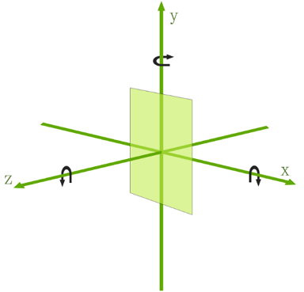

### Camera
* 注意此camera的包名为:`android.graphics.Camera`主要用来图像3D变换,实际还是操作一个Matrix矩阵对象,操作完毕后,得到一个matrix对象,然后画出图像.
* Camera用来计算3D转换,生成matrix,然后应用在画布上.
* Camera的坐标系是左手坐标系,X轴顺时针旋转为正,Y轴顺时针旋转为正,Z轴逆时针旋转为正(如下图所示)参考android坐标系

### Camera类方法使用:

* camera默认位置标准(0,0),即操作变换的初始坐标为原点
* applyToCanvas(Canvas canvas)
	> 根据当前位置变换计算出相应的矩阵,然应用到制定的画布上
* rotateX(float degree)
* rotateY(float degree)
* rotateZ(float degree)
* save()和restore()
	> 保存状态和恢复状态
* Camera的使用需要Matrix类配合使用,Matrix用于处理三维的矩阵坐标变换,提供了tanslate(),rotate(),scale(),skew()四种变换操作,四种变换内部都是通过matrix.setvalue()来设置矩阵值达到变换图形效果.

### 实现一个3D翻转的效果:

	public class Rotate3dAnimation extends Animation {
	
	    private float mFromDegrees; //起始角度
	    private float mToDegrees; //结束角度
	    private float mCenterX;
	    private float mCenterY; // Y轴中心点
	    private float mDepthZ; //z轴偏移量
	    private boolean mReverse;
	    private int position;
	    private Camera mCarmera;
	
	    public Rotate3dAnimation(float mFromDegrees, float mToDegrees, float mCenterX, float mCenterY,
	                             float mDepthZ, boolean mReverse, int position) {
	        this.mFromDegrees = mFromDegrees;
	        this.mToDegrees = mToDegrees;
	        this.mCenterX = mCenterX;
	        this.mCenterY = mCenterY;
	        this.mDepthZ = mDepthZ;
	        this.mReverse = mReverse;
	        this.position = position;
	    }
	
	    @Override
	    public void initialize(int width, int height, int parentWidth, int parentHeight) {
	        super.initialize(width, height, parentWidth, parentHeight);
	
	        //Camera为左手坐标系,默认位置为(0,0)做变换操作
	        mCarmera = new Camera();
	    }
	
	    @Override
	    protected void applyTransformation(float interpolatedTime, Transformation t) {
	        super.applyTransformation(interpolatedTime, t);
	
	        float degree = mFromDegrees + (mToDegrees - mFromDegrees) * interpolatedTime; //旋转角度
	
	        Matrix matrix = t.getMatrix();//获取变换矩阵
	
	        mCarmera.save();
	        if (mReverse) {
	            mCarmera.translate(0f, 0f, mDepthZ * interpolatedTime);//沿Z轴平移,使得物体渐渐远去.
	        } else {
	            mCarmera.translate(0f, 0f, mDepthZ * (1.0f - interpolatedTime));
	        }
	        if (position % 2 == 0) {
	            mCarmera.rotateX(degree); //绕Y轴旋转(左手坐标为顺时针旋转)
	        } else {
	            mCarmera.rotateY(degree);
	        }
	
	        // compute the matrix corresponding to the current transformation,
	        // and copy it to the supplied matrix object
	        mCarmera.getMatrix(matrix);
	        mCarmera.restore();
	
	        //弄清楚matrix.set,pre,post变换操作的执行顺序,set:清空队列,pre:插入队列前,post:插入队列后面
	        matrix.preTranslate(-mCenterX, -mCenterY);//旋转前平移
	        matrix.postTranslate(mCenterX, mCenterY); //旋转后平移
	
	    }
	}
